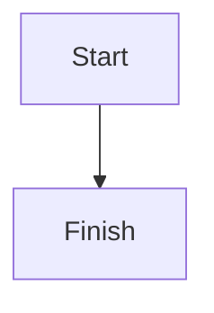

# Docsector Block Catalog

This catalog summarizes the Docsector authoring blocks that an agent should know before writing documentation. Each block has live manual pages at `manual/content/blocks/{slug}/overview` and usually `manual/content/blocks/{slug}/showcase`.

## Custom Element Blocks

| Block         | Syntax                                              | Use For                                                  | Manual Path                                    |
| ------------- | --------------------------------------------------- | -------------------------------------------------------- | ---------------------------------------------- |
| Quick Links   | `<d-block-quick-links>` with `<d-block-quick-link>` | Small sets of next-step links                            | `manual/content/blocks/quick-links/overview`   |
| Cards         | `<d-block-cards>` with `<d-block-card>`             | Visual navigation grids and landing sections             | `manual/content/blocks/cards/overview`         |
| Timeline      | `<d-block-timeline>` with `<d-block-timeline-item>` | Changelogs, release notes, rollout logs                  | `manual/content/blocks/timeline/overview`      |
| Stepper       | `<d-block-stepper>` with `<d-block-step>`           | Guided multi-step flows with navigation                  | `manual/content/blocks/stepper/overview`       |
| Expandable    | `<d-block-expandable>`                              | Optional details, appendices, longer examples            | `manual/content/blocks/expandable/overview`    |
| Files         | `<d-block-file>`                                    | Download cards for attachments                           | `manual/content/blocks/files/overview`         |
| Embedded URLs | `<d-block-embedded-url>`                            | YouTube, Vimeo, Spotify, CodePen, or link-card fallbacks | `manual/content/blocks/embedded-urls/overview` |
| Code Examples | `<d-block-code-example>`                            | Live Vue SFC previews with source inspection             | `manual/content/blocks/code-examples/overview` |
| API Reference | `<d-block-api>`                                     | Quasar-compatible JSON API reference UIs                 | `manual/content/blocks/api-reference/overview` |

### Quick Links

Use Quick Links when a page needs a compact group of destinations without a long prose list.

```html
<d-block-quick-links title="Get started">
  <d-block-quick-link
    title="Install"
    description="Set up the project"
    to="/guide/getting-started"
  />
  <d-block-quick-link
    title="GitHub"
    description="Open the repository"
    href="https://github.com/docsector/docsector-reader"
  />
</d-block-quick-links>
```

Use `to` for internal navigation and `href` for external URLs. Keep descriptions short.

### Cards

Use Cards for landing sections, curated resource grids, and visual navigation.

```html
<d-block-cards title="Explore more">
  <d-block-card
    title="Install"
    description="Set up the project"
    to="/guide/getting-started"
    image="/images/cards/getting-started-cover.svg"
  />
  <d-block-card
    title="GitHub"
    description="Open the repository"
    href="https://github.com/docsector/docsector-reader"
    icon="launch"
  />
</d-block-cards>
```

Prefer `image` for landing-page tiles and `icon` for lighter cards without covers.

### Timeline

Use Timeline for chronological entries such as changelogs, release notes, migrations, and rollout journals.

```html
<d-block-timeline>
  <d-block-timeline-item date="2025-12-25" anchor="brand-new-update">
    <d-block-timeline-tag color="warning" icon="rocket_launch"
      >beta</d-block-timeline-tag
    >
    <d-block-timeline-tag color="secondary" text-color="white"
      >docs</d-block-timeline-tag
    >

    ## A brand new update Use this block for release notes, product
    announcements, migration notices, or operational updates.
  </d-block-timeline-item>
</d-block-timeline>
```

Every item needs `date`. Tags are optional and support text content or `label`, plus `color`, `text-color`, and `icon`. `anchor` is optional; Docsector can generate one from the date and first visible text. Headings inside timeline items are flattened so the page ToC stays stable.

### Stepper

Use Stepper when the reader should move through a guided sequence.

```html
<d-block-stepper>
  <d-block-step title="Install dependencies">
    Run `npm install` in the project root.
  </d-block-step>

  <d-block-step
    title="Ship the release"
    icon="rocket_launch"
    active-icon="rocket_launch"
    done-icon="task_alt"
  >
    Use icon attributes when a numbered prefix is not expressive enough.
  </d-block-step>
</d-block-stepper>
```

Every step needs `title`. Step bodies support common Markdown such as paragraphs, lists, hints, code fences, images, tables, and math. Avoid nested Stepper blocks and other custom Docsector blocks inside steps in the current version.

### Expandable

Use Expandable for optional material that should not interrupt the main reading path.

```html
<d-block-expandable title="Release checklist" open="true">
  - Review breaking changes - Update screenshots - Run smoke tests
</d-block-expandable>
```

Use `open="true"` to start expanded. Keep page headings outside expandable bodies because inner headings are flattened. Avoid nesting one expandable inside another.

### Files

Use Files for attachments such as checklists, PDFs, sample bundles, and release assets.

```html
<d-block-file
  src="/files/manual/release-checklist.txt"
  title="Release checklist"
  size="1 KB"
>
  Download the example attachment used in this manual.
</d-block-file>
```

`src` is required. `title` and `size` are optional. When `title` is omitted, Docsector falls back to the file name from `src`. Store repo-tracked attachments under `public/files/` and reference them as `/files/...`.

### Embedded URLs

Use Embedded URLs for curated public embeds while keeping Docsector's consistent card and preview treatment.

```html
<d-block-embedded-url
  url="https://www.youtube.com/watch?v=M7lc1UVf-VE"
  title="YouTube player demo"
>
  Optional caption rendered as inline Markdown.
</d-block-embedded-url>
```

`url` is required and `title` is optional. Supported providers are YouTube, Vimeo, Spotify, and CodePen. Unsupported or private URLs render as safe external-link cards.

### Code Examples

Use Code Examples to render project Vue SFCs as live previews with source inspection.

```html
<d-block-code-example
  src="manual/code-examples/basic-counter"
  title="Basic counter"
/>
```

Place examples under `src/examples/**/*.vue`. The `src` value is normalized to kebab-case, so `manual/code-examples/basic-counter` resolves to `src/examples/manual/code-examples/BasicCounter.vue`. `file` is an alias for `src`.

Common attributes:

| Attribute    | Purpose                                        |
| ------------ | ---------------------------------------------- |
| `src`        | Example id under `src/examples/**/*.vue`       |
| `file`       | Alias for `src`                                |
| `title`      | Header title above the preview                 |
| `expanded`   | Opens the source panel by default when `true`  |
| `codepen`    | Shows the CodePen action unless set to `false` |
| `scrollable` | Gives the preview a fixed scrollable height    |
| `overflow`   | Allows horizontal and vertical overflow        |
| `height`     | Sets a preview height such as `360` or `420px` |

### API Reference

Use API Reference blocks to render Quasar-compatible JSON API documentation.

```html
<d-block-api src="/quasar-api/QSeparator.json" />

<d-block-api
  src="/api/manual/http-client.json"
  title="HTTP Client API"
  page-link="true"
/>
```

`src` is required and should point to same-origin JSON. `title` overrides the header. `page-link="true"` shows a Docs button when the JSON includes `meta.docsUrl`. Useful JSON sections include `props`, `methods`, `events`, `value`, `arg`, and `quasarConfOptions`; entries with `internal: true` are hidden.

## Markdown and Native Blocks

| Block            | Syntax                     | Use For                         | Manual Path                                       |
| ---------------- | -------------------------- | ------------------------------- | ------------------------------------------------- |
| Paragraphs       | Plain Markdown text        | Explanations and transitions    | `manual/content/blocks/paragraphs/overview`       |
| Headings         | `##`, `###`, `####`        | Sections, anchors, page ToC     | `manual/content/blocks/headings/overview`         |
| Unordered Lists  | `- item`                   | Feature sets and requirements   | `manual/content/blocks/unordered-lists/overview`  |
| Ordered Lists    | `1. item`                  | Sequential procedures           | `manual/content/blocks/ordered-lists/overview`    |
| Task Lists       | `- [ ] item`, `- [x] item` | Static checklists               | `manual/content/blocks/task-lists/overview`       |
| Hints            | `> [!WARNING]`             | Semantic notes and warnings     | `manual/content/blocks/hints/overview`            |
| Quotes           | `> text`                   | Neutral quoted text             | `manual/content/blocks/quotes/overview`           |
| Code Blocks      | Fenced code                | Commands and snippets           | `manual/content/blocks/code-blocks/overview`      |
| Mermaid Diagrams | Fenced `mermaid` code      | Flowcharts and diagrams         | `manual/content/blocks/mermaid-diagrams/overview` |
| Images           | ``    | Screenshots and illustrations   | `manual/content/blocks/images/overview`           |
| Math and TeX     | `$...$`, `$$...$$`         | Inline and display equations    | `manual/content/blocks/math-and-tex/overview`     |
| Tables           | Markdown tables            | Comparisons and matrices        | `manual/content/blocks/tables/overview`           |
| Raw HTML         | HTML tags                  | Custom structure and attributes | `manual/content/blocks/raw-html/overview`         |

### Paragraphs

Use paragraphs for narrative copy. Separate paragraphs with a blank line. Inline emphasis, links, inline code, and math work inside normal paragraphs.

### Headings

Use headings to organize the page and feed the right-side table of contents. In page content, start with `##` because the page title is generated from page metadata. Keep heading levels in order and use headings for sections that readers may bookmark or deep-link.

### Lists

Use unordered lists when order does not matter. Use ordered lists when sequence matters. Use task lists when each item should show a done or not-done state. Published task-list checkboxes are static and cannot be toggled by readers.

### Hints

Use GitHub-style alert markers in blockquotes:

```markdown
> [!WARNING]
> This operation may interrupt workers.
```

Supported markers are `NOTE`, `TIP`, `IMPORTANT`, `WARNING`, and `CAUTION`. Unknown markers fall back to regular quotes.

### Quotes

Use regular blockquotes for cited text or neutral notes that should stand apart from the main flow without semantic alert styling.

```markdown
> This is a regular quote.
```

### Code Blocks

Use fenced code blocks for commands and snippets. Docsector renders syntax highlighting, line numbers, copy support, grouped tabs, breadcrumbs, and file metadata.

````markdown
```bash :filename="install.sh";
npm install
npm run dev
```
````

Useful metadata attributes are `filename`, `group`, `tab`, `breadcrumb`, and `toolbar` using `:attr;` syntax.

The metadata bar (language label + copy button) appears by default only on multi-line blocks, or on blocks with tabs or a breadcrumb — a single-line block renders bare. Override that per block with `toolbar`:

````markdown
```bash :toolbar="true";
curl -fsSL https://example.com/install | bash
```
````

Use `:toolbar="true";` on a single-line command readers are meant to copy, and `:toolbar="false";` to strip the bar from a block nobody copies, such as a long output dump or an ASCII tree.

### Mermaid Diagrams

Use a fenced `mermaid` block for diagrams.

````markdown

````

Docsector lazy-loads Mermaid, renders responsive SVG, adapts to light and dark mode, and shows a safe error state for invalid Mermaid syntax.

### Images

Use standard Markdown images for screenshots, illustrations, diagrams, and product UI.

```markdown

```

Standalone Markdown images render as block figures with click-to-zoom. The label is used as both caption and alt text. Use raw `<figure>` and `<picture>` markup when alt text and visible caption need to differ.

### Math and TeX

Use single dollar delimiters for inline math and double dollar delimiters for display math.

```markdown
Use $E = mc^2$ inside a sentence.

$$
\int_0^1 x^2 dx
$$
```

Math works in paragraphs, hints, and expandable blocks. Delimiters remain literal inside inline code and fenced code blocks.

### Tables

Use tables for comparisons, option matrices, compatibility notes, and scannable row-column content.

```markdown
| Feature | Status | Notes                    |
| ------- | ------ | ------------------------ |
| Search  | Done   | Available in the sidebar |
```

Keep column labels short. Split very dense tables into smaller sections.

### Raw HTML

Use raw HTML only when Markdown is not expressive enough or when authoring Docsector custom elements.

```html
<div data-kind="secondary-note">
  This block uses raw HTML inside the page source.
</div>
```

Prefer plain Markdown first. Keep raw markup readable because documentation content still needs maintenance.

## Renderer and Parser References

- `src/components/page-section-tokens.js` parses custom elements and Markdown tokens.
- `src/components/DPageTokens.vue` dispatches tokens to block components.
- `src/components/DBlockCards.vue`, `DBlockQuickLinks.vue`, `DBlockTimeline.vue`, `DBlockStepper.vue`, `DBlockExpandable.vue`, `DBlockFile.vue`, `DBlockEmbeddedUrl.vue`, `DBlockCodeExample.vue`, and `DBlockApi.vue` render custom element blocks.
- `src/components/DBlockSourceCode.vue`, `DBlockMermaidDiagram.vue`, `DBlockBlockquote.vue`, and `DBlockImage.vue` render richer Markdown blocks.
