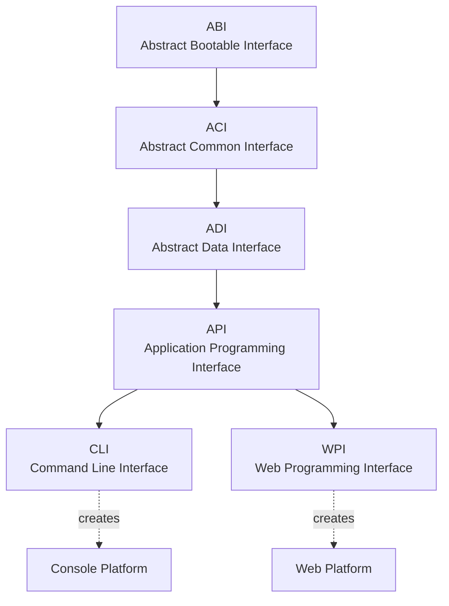

# Why Bootgly?

The key point of Bootgly is integration as a base for efficiency, performance and versatility, generating as a consequence APIs for easy understanding.

Bootgly is built on three **Core Principles** that guide every design decision in the framework: **One-way policy**, **Minimum dependency** and **Strict layer separation**. Together, these principles ensure that Bootgly remains coherent, performant and easy to understand as it grows.

## One-way policy

There is exactly **one canonical way** to do each thing in Bootgly — one HTTP server, one config schema, one autoloader, one test framework. This avoids confusion, reduces maintenance burden and keeps AI-generated code precise.

While many frameworks offer multiple ORMs, several template engines, or different testing libraries to choose from, Bootgly deliberately provides a single, well-integrated solution for each concern:

- **One test framework** — `ACI/Tests` provides the Specification-based testing system used across the entire framework;
- **One autoloader** — a single `spl_autoload_register` with the root/working directory pattern;
- **One HTTP server** — `HTTP_Server_CLI` is the built-in, high-performance HTTP server;
- **One middleware pipeline** — `API/Server/Middlewares` with the onion pattern via interface-only middlewares;
- **One template engine** — `ABI/Templates` for server-side rendering.

This one-way policy brings clarity: when you search for "how to do X in Bootgly", there is always one answer. It also makes the framework highly predictable for AI-assisted development, since there is no ambiguity about which tool or pattern to use.

## Minimum dependency

It is normal when creating a new package to take advantage of the existence of other third-party packages to speed up development in the short term, but as everything in engineering, there are always advantages and disadvantages in it.

We understand that a Framework is something base, and as such, there should not be many third-party packages in your composition because the greater the external dependency, the less integrated and fragile the project as a whole can be, generating some problems:

1. Notifications and bug fixes and vulnerabilities of third-party packages can decrease the reaction time of patch releases;
2. In the medium or long term, external dependencies can delay the implementation of new features and improvements due to limitations that may exist in the API of the third party package;
3. The dependency on third party packages increases the learning curve for beginners and for potential source code contributors because it forces learning of external projects with different authors and coding styles.

Bootgly has this policy of **minimum dependency** to third party packages, allowing more secure development, with the maximum integration between internal components, favoring the rapid implementation of new features and improvements, and making the code base easy to understand.

With this view, many Bootgly features are built-in and are fully integrated with the Framework itself, thus allowing complete integration with the possibility of rapid extension of its capabilities.

Here are some concrete examples of built-in features that replace typical third-party dependencies:

- **Template engine** — `ABI/Templates` with directives and iterators;
- **Test framework** — `ACI/Tests` with Assertions, Suites and Specifications;
- **HTTP Server** — `WPI/Nodes/HTTP_Server_CLI` with multi-worker support;
- **Middleware pipeline** — `API/Server/Middlewares` with onion-pattern execution;
- **Built-in middlewares** — CORS, RateLimit, Compression, ETag, SecureHeaders, and more.

The big downside to this approach is that launches become more time-consuming.

## Strict layer separation

Bootgly's I2P architecture defines six interfaces with a **strict dependency direction** — each layer can only depend on the layers below it. No cross-layer skipping is allowed.

The six interfaces, from the most foundational to the most specialized, are:

1. **ABI** (Abstract Bootable Interface) — everything related to booting and OS-level abstractions: filesystem, configurations, templates, debugging;
2. **ACI** (Abstract Common Interface) — everything common in software: benchmarks, events, logs, tests;
3. **ADI** (Abstract Data Interface) — everything related to data: databases, tables;
4. **API** (Application Programming Interface) — everything intrinsic to the application: projects, environments, server handlers, middleware pipeline;
5. **CLI** (Command Line Interface) — commands, scripts, terminal I/O and UI components for the Console;
6. **WPI** (Web Programming Interface) — TCP/HTTP servers and clients, protocol modules, routing for the Web.

This is the **I2P (Interface-to-Platform)** architecture: the top-level interfaces (CLI and WPI) each give rise to a **Platform** — CLI creates the **Console** platform and WPI creates the **Web** platform. Each platform can then contain its own interfaces and workables.

Future platforms may include **AI** (originating from ADI), **Graphics** (from a future GUI interface), Embedded and Mobile.
