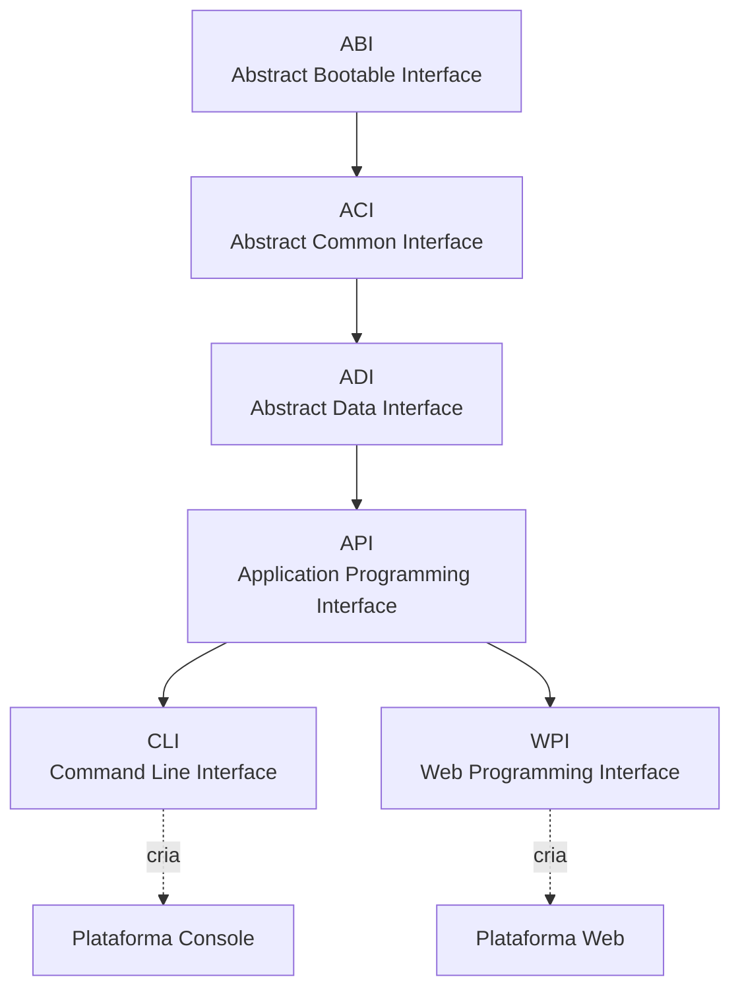

# Por que Bootgly?

O ponto chave do Bootgly é integração como base para eficiência, performance e versatilidade, gerando como consequência APIs componíveis e de fácil entendimento.

O Bootgly é construído sobre três **Princípios Fundamentais** que guiam cada decisão de design no framework: **Política de caminho único**, **Mínimo de dependências** e **Separação estrita de camadas**. Juntos, esses princípios garantem que o Bootgly permaneça coerente, performático e fácil de entender à medida que cresce.

## Política de caminho único

Existe exatamente **uma forma canônica** de fazer cada coisa no Bootgly — um HTTP server, um schema de configuração, um autoloader, um framework de testes. Isso evita confusão, reduz a carga de manutenção e mantém o código gerado por IA preciso.

Enquanto muitos frameworks oferecem múltiplos ORMs, vários template engines ou diferentes bibliotecas de teste para escolher, o Bootgly deliberadamente fornece uma única solução bem integrada para cada responsabilidade:

- **Um framework de testes** — `ACI/Tests` fornece o sistema de testes baseado em Specifications usado em todo o framework;
- **Um autoloader** — um único `spl_autoload_register` com o padrão de diretório root/working;
- **Um HTTP server** — `HTTP_Server_CLI` é o servidor HTTP built-in de alta performance;
- **Um middleware pipeline** — `API/Server/Middlewares` com o padrão onion via middlewares interface-only;
- **Um template engine** — `ABI/Templates` para renderização server-side.

Essa política de caminho único traz clareza: quando você procura "como fazer X no Bootgly", sempre há uma resposta. Também torna o framework altamente previsível para desenvolvimento assistido por IA, já que não há ambiguidade sobre qual ferramenta ou padrão usar.

## Mínimo de dependências

É normal quando se cria um novo pacote, aproveitar a existência de outros pacotes de terceiros para agilizar o desenvolvimento no curto prazo, mas como tudo na engenharia, sempre existem as vantagens e desvantagens nisso.

Entendemos que um Framework é algo base, e como tal, não deve haver muitos pacotes de terceiros em sua composição porque quanto maior a dependência externa, menos integrado e frágil pode ficar o projeto como um todo, gerando alguns problemas:

1. A dependência para notificações e correções de bugs e vulnerabilidades de pacotes de terceiros podem diminuir o tempo de reação de lançamentos de patchs;
2. No médio ou longo prazo, as dependências externas podem atrasar a implementação de novos recursos e melhorias, devido a limitações que podem existir no Code API do pacote de terceiro;
3. A dependência de pacotes de terceiros aumenta a curva de aprendizado para iniciantes e para potenciais contribuintes do código fonte, porque força o aprendizado de projetos externos com autores e estilos de código diferentes.

O Bootgly tem essa política de **dependência mínima** à pacotes de terceiros, permitindo um desenvolvimento mais seguro, com o máximo de integração entre os componentes internos, favorecendo a rápida implementação de novos recursos e melhorias, e fazendo com que o código base seja de fácil entendimento.

Com essa visão, muitos recursos do Bootgly são `built-in` e são totalmente integrados com o Framework em si, permitindo assim, uma integração completa com possibilidade de rápida extensão das suas funcionalidades.

Aqui estão alguns exemplos concretos de funcionalidades built-in que substituem dependências típicas de terceiros:

- **Template engine** — `ABI/Templates` com diretivas e iteradores;
- **Framework de testes** — `ACI/Tests` com Assertions, Suites e Specifications;
- **HTTP Server** — `WPI/Nodes/HTTP_Server_CLI` com suporte multi-worker;
- **Middleware pipeline** — `API/Server/Middlewares` com execução em padrão onion;
- **Middlewares built-in** — CORS, RateLimit, Compression, ETag, SecureHeaders, e mais.

A grande desvantagem dessa abordagem é que os lançamentos podem se tornar mais demorados.

## Separação estrita de camadas

A arquitetura I2P do Bootgly define seis interfaces com uma **direção de dependência estrita** — cada camada só pode depender das camadas abaixo dela. Não é permitido pular camadas.

As seis interfaces, da mais fundamental à mais especializada, são:

1. **ABI** (Abstract Bootable Interface) — tudo relacionado à inicialização e abstrações de nível de SO: filesystem, configurações, templates, debugging;
2. **ACI** (Abstract Common Interface) — tudo que é comum em softwares: benchmarks, eventos, logs, testes;
3. **ADI** (Abstract Data Interface) — tudo relacionado a dados: bancos de dados, tabelas;
4. **API** (Application Programming Interface) — tudo intrínseco à aplicação: projetos, ambientes, handlers de servidor, middleware pipeline;
5. **CLI** (Command Line Interface) — comandos, scripts, I/O de terminal e componentes de UI para o Console;
6. **WPI** (Web Programming Interface) — servidores e clientes TCP/HTTP, módulos de protocolo, roteamento para a Web.

Esta é a arquitetura **I2P (Interface-to-Platform)**: as interfaces de nível superior (CLI e WPI) dão origem a uma **Plataforma** — CLI cria a plataforma **Console** e WPI cria a plataforma **Web**. Cada plataforma pode então conter suas próprias interfaces e workables.

Plataformas futuras podem incluir **AI** (originada da ADI), **Graphics** (de uma futura interface GUI), Embedded e Mobile.
