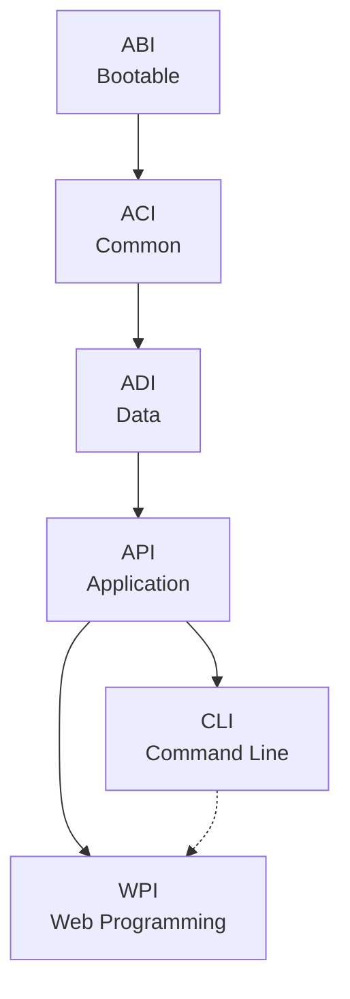
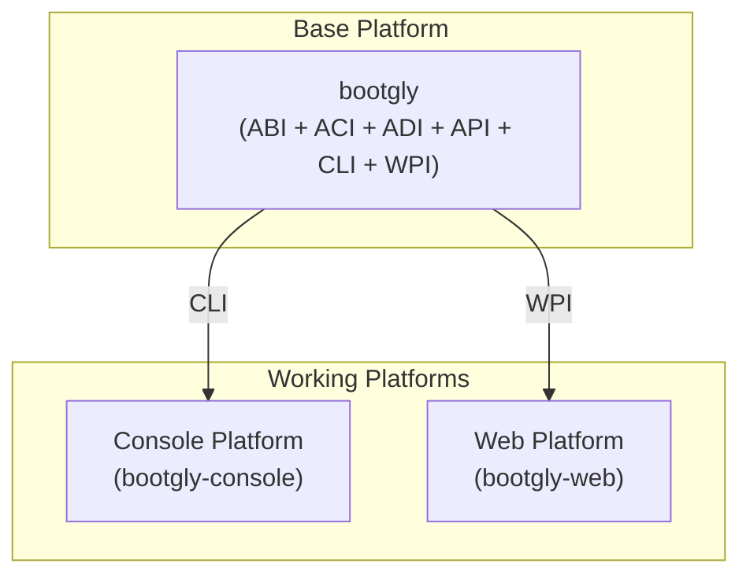

# Architecture

Bootgly has introduced a new way of developing frameworks using its own architecture called **I2P (Interface-to-Platform)**.

In the I2P architecture, everything starts with interfaces, which later give rise to platforms.

## Explicit modules

In many frameworks, systems, and apps, modules are defined and separated **implicitly**: their boundaries are diluted across several files and folders, and the only way to reconstruct them is by reading the code.

In Bootgly, module separation is **explicit**: each module is a folder, and each folder is named after the acronym that identifies its module. Examples of modules: `ABI`, `ACI`, `ADI`, `API`, `CLI` and `WPI`.

Two simple visual rules keep this separation recognizable at a glance:

- **Framework module folders** start with an **uppercase** letter — `ABI/`, `ACI/`, `ADI/`, `API/`, `CLI/`, `WPI/`;
- **Resource folders** start with a **lowercase** letter — like `tests/`, which can be found in several places in the codebase.

This is what the base platform looks like on disk:

```text
Bootgly/
├── ABI/          ← module folder (uppercase)
├── ACI/
├── ADI/
├── API/
├── CLI/
├── WPI/
├── commands/     ← resource folder (lowercase)
├── ABI.php
├── ACI.php
├── ADI.php
├── API.php
├── CLI.php
└── WPI.php
```

> [!NOTE]
> Every module folder has a same-level entity with the same name (`ABI/` → `ABI.php`). This is one of Bootgly's organizational rules, detailed on the next page.

In Bootgly, these modules are not ordinary namespaces: **each module is an Interface**, and the interfaces are what define the I2P architecture itself.

## Interfaces

The concept of "Interfaces" in Bootgly has a very clear and defined meaning:

> "Interface is everything that connects two distinct systems, allowing them to communicate, interact or exchange information between them."

### Meaning

The word "interface" comes from Latin "inter" (between) and "facies" (face, appearance), which means "the surface or point of contact between two things"

The term "interface" can be used to refer to anything that unites two parts for communication. An interface is usually a layer of abstraction that allows different systems, components, or devices to communicate in a standardized way, even if they have been designed independently.

For example, an operating system has a user interface (UI) that allows users to interact with the system. This interface is designed to be used by people, and it offers a standardized way to access different features and functionalities of the system. Here we have the following interface:

`Person <-UI-> System`

Likewise, a program in the Front-end may have an application programming interface (API) that allows another application in the Back-end to communicate with it. Here we might have the following interface:

`App (Client) <-API-> (Server) DB`

### Bootgly Interfaces

In Bootgly, the base interfaces are:

- **ABI (Abstract Bootable Interface)** — Core bootstrap infrastructure: configs, data handling, IO, resources, and the template engine. The foundation everything else builds upon.
- **ACI (Abstract Common Interface)** — Shared utilities for observability: benchmarking, event system, logging, and the built-in test framework.
- **ADI (Abstract Data Interface)** — Data layer abstractions: database connections, table operations, and ORM foundations.

- **API (Application Programming Interface)** — Application orchestration: components, endpoints, environments, projects, and server management. Forks into CLI and WPI.

- **CLI (Command Line Interface)** — Terminal UI components: alerts, menus, progress bars, tables, and interactive commands.
- **WPI (Web Programming Interface)** — Web infrastructure: HTTP server, TCP server, TCP client — high-performance networking from the ground up.

The interfaces follow a strict dependency direction — each layer can only depend on the layers that come before it:

`ABI → ACI → ADI → API → CLI → WPI`



WPI comes after CLI in the dependency order, so it may also use CLI components (dashed arrow) — for example, terminal commands for a Web server — while CLI can never depend on WPI.

On the next page, you will see how the Interface folders are structured in the base Bootgly platform and what each one represents.

## Bootgly Platforms

In the I2P architecture, interfaces give rise to platforms. There are two types of platforms: **base platforms** and **working platforms**.

> The _base platforms_ contain a set of Initial Interfaces and the _working platforms_ are made up of at least one Interface that exists on a _base platform_.

### Base platform

The `bootgly` repository represents the **base platform**. It is where the first interfaces live — the essential ones, used by all the other working platforms:

`ABI`, `ACI`, `ADI`, `API`, `CLI` and `WPI`.

### Working platforms

The working platforms are **Console** and **Web**:

| Platform | Repository        | Origin interface |
| -------- | ----------------- | ---------------- |
| Console  | `bootgly-console` | CLI              |
| Web      | `bootgly-web`     | WPI              |

Each working platform is born from at least one interface of the base platform: the Console platform emerges from the `CLI` interface, and the Web platform emerges from the `WPI` interface.

Working platforms may contain their own interfaces and the so-called "workables". For example, the _Web platform_ is expected to have an Interface called `API` — representing a Web API — and a `workable` called `App`, containing the necessary dependencies to formalize a Web application within Bootgly.

> [!NOTE]
> The interfaces of the working platforms are still going to be defined — the `bootgly-console` and `bootgly-web` repositories are in an early stage of development.



In the future, there may be another interface called "GUI" (Graphical User Interface), which could give rise to another platform called "Graphical", which will serve for the construction of graphical applications using PHP.
