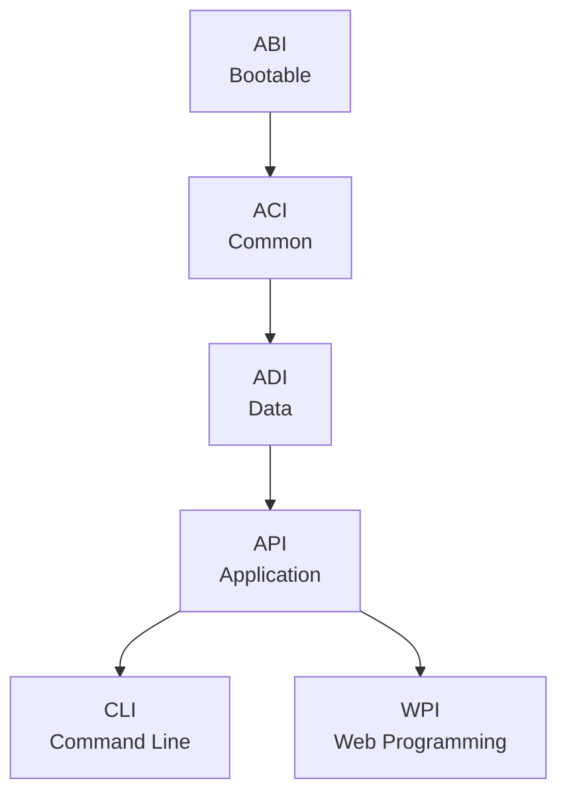
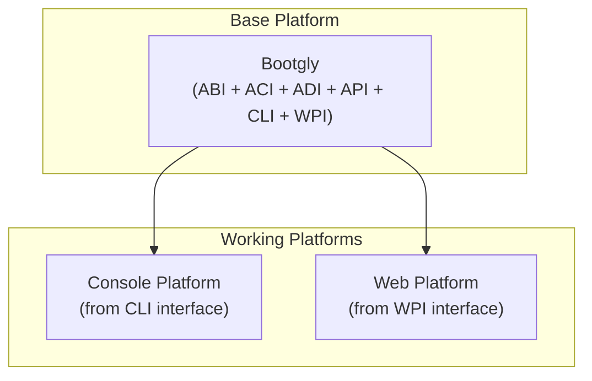

# Architecture

Bootgly has introduced a new way of developing frameworks using its own architecture called **I2P (Interface-to-Platform)**.

In the I2P architecture, everything starts with interfaces, which later give rise to platforms.

## Interfaces

The concept of "Interfaces" in Bootgly has a very clear and defined meaning:

> "Interface is everything that connects two distinct systems, allowing them to communicate, interact or exchange information between them."

### Meaning

The word "interface" comes from Latin "inter" (between) and "facies" (face, appearance), which means "the surface or point of contact between two things"

The term "interface" can be used to refer to anything that unites two parts for communication. An interface is usually a layer of abstraction that allows different systems, components, or devices to communicate in a standardized way, even if they have been designed independently.

For example, an operating system has a user interface (UI) that allows users to interact with the system. This interface is designed to be used by people, and it offers a standardized way to access different features and functionalities of the system. Here we have the following interface:

`Person <-UI-> System`

Likewise, a program in the Front-end may have an application programming interface (API) that allows another application in the Back-end to communicate with it. Here we might have the following interface:

`App (Client) <-API-> (Server) DB`

### Bootgly Interfaces

In Bootgly, the interfaces are:

- **ABI (Abstract Bootable Interface)** — Core bootstrap infrastructure: configs, data handling, IO, resources, and the template engine. The foundation everything else builds upon.
- **ACI (Abstract Common Interface)** — Shared utilities for observability: benchmarking, event system, logging, and the built-in test framework.
- **ADI (Abstract Data Interface)** — Data layer abstractions: database connections, table operations, and ORM foundations.

- **API (Application Programming Interface)** — Application orchestration: components, endpoints, environments, projects, and server management. Forks into CLI and WPI.

- **CLI (Command Line Interface)** — Terminal UI components: alerts, menus, progress bars, tables, and interactive commands. Creates the **Console Platform**.
- **WPI (Web Programming Interface)** — Web infrastructure: HTTP server, TCP server, TCP client — high-performance networking from the ground up. Creates the **Web Platform**.

The interfaces follow a strict dependency direction — each layer can only depend on the layers below it:

On the next page, you will see how the Interface folders are structured in the base Bootgly platform and what each one represents.

## Bootgly Platforms

In Bootgly, there are **base platforms** and **working platforms**.

> The _base platforms_ contain a set of Initial Interfaces and the _working platforms_ are made up of at least one Interface that exists on a _base platform_.

_Working platforms_ may contain other interfaces and the so-called "workables".

For example, in the _Web platform_, there is an Interface called `API` that represents a Web API and there is a `workable` called `App` that contains the necessary dependencies to formalize a Web application within Bootgly.

In Bootgly the current platforms are:

- Bootgly (base platform)
- Console (CLI interface platform)
- Web (WPI interface platform)

In the future, there may be another interface called "GUI" (Graphical User Interface), which could give rise to another platform called "Graphical", which will serve for the construction of graphical applications using PHP.
