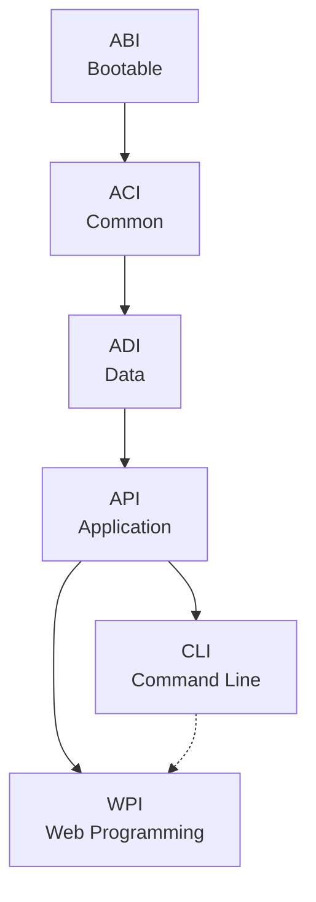
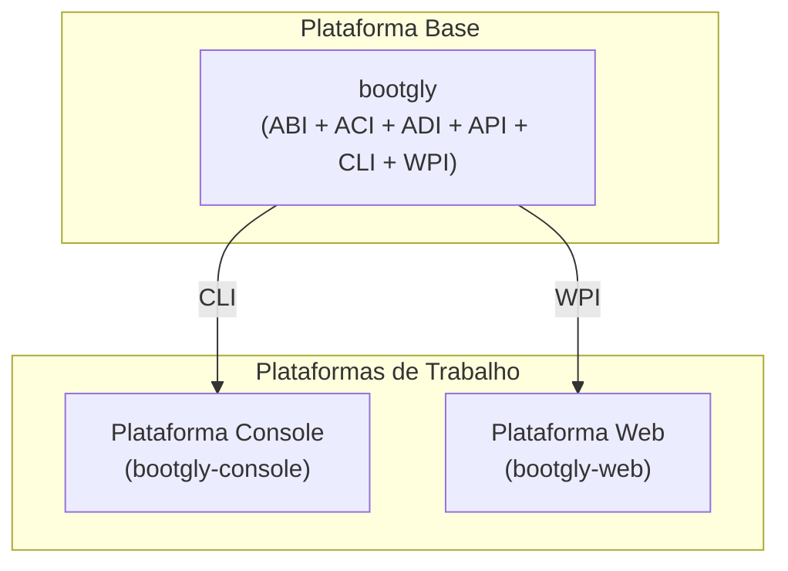

# Arquitetura

O Bootgly introduziu um jeito novo de desenvolver frameworks utilizando uma arquitetura própria chamada de **I2P (Interface-to-Platform)**.

Na arquitetura I2P, tudo começa com interfaces, que posteriormente dão origem a plataformas.

## Módulos explícitos

Em muitos frameworks, sistemas e apps, os módulos são definidos e separados de forma **implícita**: suas fronteiras ficam diluídas ao longo de vários arquivos e pastas, e a única forma de reconstruí-los é lendo o código.

No Bootgly, a separação de módulos é **explícita**: cada módulo é uma pasta, e cada pasta é nomeada pela sigla que identifica o seu módulo. Exemplos de módulos: `ABI`, `ACI`, `ADI`, `API`, `CLI` e `WPI`.

Duas regras visuais simples mantêm essa separação reconhecível à primeira vista:

- **Pastas de módulos do framework** começam com letra **maiúscula** — `ABI/`, `ACI/`, `ADI/`, `API/`, `CLI/`, `WPI/`;
- **Pastas de recursos** começam com letra **minúscula** — como `tests/`, que pode ser encontrada em vários locais do código.

É assim que a plataforma base se apresenta em disco:

```text
Bootgly/
├── ABI/          ← pasta de módulo (maiúscula)
├── ACI/
├── ADI/
├── API/
├── CLI/
├── WPI/
├── commands/     ← pasta de recurso (minúscula)
├── ABI.php
├── ACI.php
├── ADI.php
├── API.php
├── CLI.php
└── WPI.php
```

> [!NOTE]
> Toda pasta de módulo possui uma entidade de mesmo nível com o mesmo nome (`ABI/` → `ABI.php`). Essa é uma das regras organizacionais do Bootgly, detalhada na próxima página.

No Bootgly, esses módulos não são namespaces comuns: **cada módulo é uma Interface**, e as interfaces são o que define a própria arquitetura I2P.

## Interfaces

O conceito de "Interfaces" no Bootgly possui um significado bem claro e definido:

> "Interface é tudo o que conecta dois sistemas distintos, permitindo que eles se comuniquem, interajam ou troquem informações entre si."

### Significado

A palavra "interface" vem do latim "inter" (entre) e "facies" (face, aparência), o que significa "a superfície ou ponto de contato entre duas coisas"

O termo "interface" pode ser usado para se referir a qualquer coisa que une duas partes para comunicação. Uma interface é geralmente uma camada de abstração que permite que diferentes sistemas, componentes ou dispositivos se comuniquem de uma maneira padronizada, mesmo que tenham sido projetados independentemente.

Por exemplo, um sistema operacional possui uma interface de usuário (UI) que permite que os usuários interajam com o sistema. Esta interface é projetada para ser usada por pessoas, e oferece uma maneira padronizada para acessar diferentes recursos e funcionalidades do sistema. Aqui temos a seguinte interface:

`Pessoa <-UI-> Sistema`

Do mesmo modo, um programa no Front-end pode ter uma interface de programação de aplicativos (API) que permite que outra aplicação no Back-end se comunique com ele. Aqui podemos ter a seguinte interface:

`App (Client) <-API-> (Server) DB`

### Interfaces do Bootgly

No Bootgly, as interfaces base são:

- **ABI (Abstract Bootable Interface)** — Infraestrutura central de bootstrap: configs, manipulação de dados, IO, resources e o template engine. A base sobre a qual tudo é construído.
- **ACI (Abstract Common Interface)** — Utilitários compartilhados para observabilidade: benchmarking, sistema de eventos, logging e o framework de testes integrado.
- **ADI (Abstract Data Interface)** — Abstrações da camada de dados: conexões com banco de dados, operações de tabela e fundações de ORM.

- **API (Application Programming Interface)** — Orquestração de aplicação: componentes, endpoints, ambientes, projetos e gerenciamento de servidor. Bifurca em CLI e WPI.

- **CLI (Command Line Interface)** — Componentes de UI para terminal: alertas, menus, barras de progresso, tabelas e comandos interativos.
- **WPI (Web Programming Interface)** — Infraestrutura web: HTTP server, TCP server, TCP client — networking de alta performance do zero.

As interfaces seguem uma direção de dependência estrita — cada camada só pode depender das camadas que vêm antes dela:

`ABI → ACI → ADI → API → CLI → WPI`



A WPI vem depois da CLI na ordem de dependência, então ela também pode usar componentes da CLI (seta tracejada) — por exemplo, comandos de terminal para um servidor Web — enquanto a CLI nunca pode depender da WPI.

Na próxima página você poderá ver como as pastas das Interfaces estão estruturadas na plataforma base Bootgly e o que cada uma delas representa.

## Plataformas do Bootgly

Na arquitetura I2P, as interfaces dão origem a plataformas. Existem dois tipos de plataformas: **plataformas base** e **plataformas de trabalho**.

> As _plataformas base_ contêm um conjunto de Interfaces iniciais e as _plataformas de trabalho_ são constituídas por pelo menos uma Interface que existe em uma _plataforma base_.

### Plataforma base

O repositório `bootgly` representa a **plataforma base**. É onde estão as primeiras interfaces — as essenciais, usadas por todas as outras plataformas de trabalho:

`ABI`, `ACI`, `ADI`, `API`, `CLI` e `WPI`.

### Plataformas de trabalho

As plataformas de trabalho são **Console** e **Web**:

| Plataforma | Repositório       | Interface de origem |
| ---------- | ----------------- | ------------------- |
| Console    | `bootgly-console` | CLI                 |
| Web        | `bootgly-web`     | WPI                 |

Cada plataforma de trabalho nasce de pelo menos uma interface da plataforma base: a plataforma Console surge da interface `CLI`, e a plataforma Web surge da interface `WPI`.

As plataformas de trabalho podem conter suas próprias interfaces e os chamados "workables" (trabalháveis). Por exemplo, espera-se que a _plataforma Web_ tenha uma Interface chamada `API` — representando uma API Web — e um `workable` chamado `App`, contendo as dependências necessárias para formalizar um aplicativo Web dentro do Bootgly.

> [!NOTE]
> As interfaces das plataformas de trabalho ainda serão definidas — os repositórios `bootgly-console` e `bootgly-web` estão em estágio inicial de desenvolvimento.



No futuro poderá surgir uma outra interface chamada de "GUI" (Graphical User Interface), que poderá dar origem a uma outra plataforma chamada de "Graphical", que servirá para construções de aplicações gráficas utilizando o PHP.
