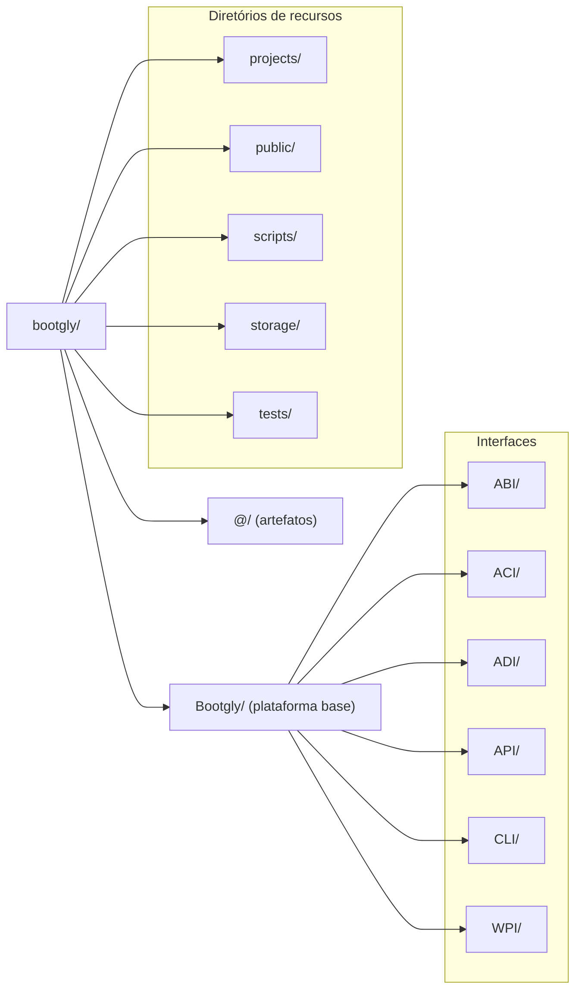

# Estrutura de diretórios

O Bootgly PHP Framework é muito organizado desde a sua fundação e oferece uma estrutura sólida para a construção de seus códigos.

Uma parte fundamental dessa estrutura é a disposição de diretórios da sua pasta raiz, que foi projetada cuidadosamente para garantir uma organização clara e eficiente em ordem crescente de dependências. Um dos motivos desse padrão é separar tudo o que é do Framework em si, de tudo o que foi produzido através dele.

Como apresentado na página de Arquitetura, essa separação é explícita e visual: as pastas de módulos do framework (as Interfaces) começam com letra **maiúscula**, enquanto os diretórios de recursos começam com letra **minúscula**.

## Diretório global @/

O diretório `@/` é um diretório global para artefatos e metadados. Ele pode ser encontrado em diretórios do Bootgly.

É um local destinado a armazenar informações relevantes como arquivos de configuração, arquivos de metadados e outros arquivos gerais específicos do contexto local de onde esse diretório se encontra.

Por ser um diretório global, você pode criá-lo em seus projetos produzidos com o Bootgly.

## Diretórios para Classes/Namespaces

Em projetos e repositórios Bootgly, o primeiro nó de um namespace começa com letra maiúscula e deve ser colocado direto dentro do diretório raiz. Você deve estar acostumado a ver o código fonte dentro do diretório `src/` que fica na raiz de um projeto, mas devido ao sistema de autoloader do Bootgly, o código fonte é carregado com um padrão próprio e único e por isso não deve ser colocado dentro do diretório `src/` porque, no Bootgly, esse diretório deveria ser considerado um diretório de recurso (ver seção "Diretórios de recursos").

### Interfaces

Dentro da pasta `Bootgly/`, que representa a plataforma base do Bootgly, estão as interfaces iniciais e elas são:

A interface `ABI` (Abstract Bootable Interface) reúne _tudo o que é "bootável"_, em um contexto relacionado à inicialização ou carregamento inicial de componentes e contém abstrações que são mais voltadas ao SO (Sistema Operacional).

A interface `ACI` (Abstract Common Interface) reúne _tudo o que é comum_ em softwares: um Debugger, Events, Logs, Tests, etc.

A interface `ADI` (Abstract Data Interface) reúne _tudo relacionado a dados_ e essa interface terá muitas implementações e poderá dar origem a uma outra plataforma no futuro.

A interface `API` (Application Programming Interface) _reúne o que é intrínseco do Bootgly_ e seu ambiente: classe Project, classe Environment, etc.

A interface `CLI` (Command Line Interface) é uma interface para interagir com um computador ou sistema operacional por meio de texto e comandos digitados em uma _linha de comando_. Ela é utilizada para construção da _plataforma Console_.

A interface `WPI` (Web Programming Interface) é uma interface que _representa a Web em um nível mais base_ onde se define implementações de protocolos por exemplo, e nela deve conter clientes e servidores bases como um TCP Server/Client, um UDP Server/Client, um HTTP Server/Client e etc. Ela é utilizada para construção da _plataforma Web_.

## Diretórios de recursos

Os diretórios de recursos obrigatoriamente começam com letra minúscula e já são bem conhecidos em qualquer projeto de programação. No Bootgly eles foram simplesmente "formalizados"!

Esses diretórios de recursos são utilizados para armazenar recursos padronizados pela interface `Resources` que se encontra na interface `ABI`. Por exemplo, uma classe chamada "Scripts" poderá padronizar diretórios "scripts/" que servirão para armazenar scripts do Bootgly. Uma classe chamada "Tests" poderá formalizar diretórios "tests/" que servirão para armazenar os arquivos para testes no Bootgly, e assim por diante! Confira abaixo os principais diretórios de recursos do Bootgly.

O diretório `projects/` será utilizado por usuários desenvolvedores para armazenar os seus projetos desenvolvidos a partir do Bootgly. Nele devem ser encontrados Apps, APIs, etc. Este diretório só deve existir dentro do diretório raiz.

O diretório `public/` servirá para armazenar arquivos da Web e só deve existir dentro do diretório raiz.

O diretório `scripts/` armazena os scripts para o CLI/Console e só deve existir dentro do diretório raiz.

O diretório `storage/` contém dados gerados, coletados ou utilizados no ambiente de trabalho, como arquivos de cache, de logs, arquivos temporários, informações sobre projetos, tarefas, etc.

Os diretórios `tests/` armazenam arquivos de bootstrap de testes e arquivos que definem um "test case". Esses diretórios devem ser criados no mesmo namespace do que está sendo testado.