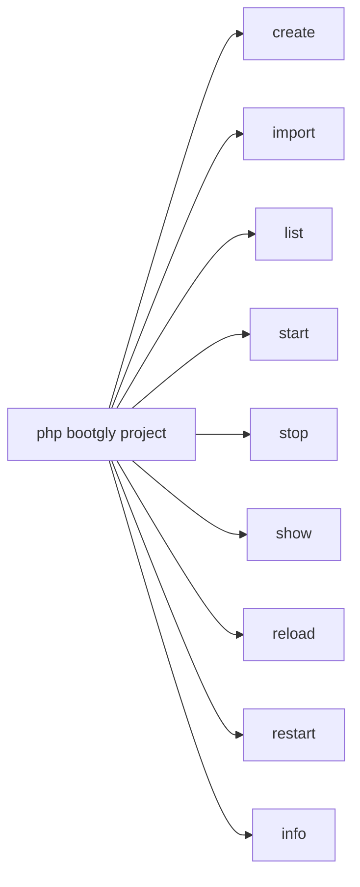
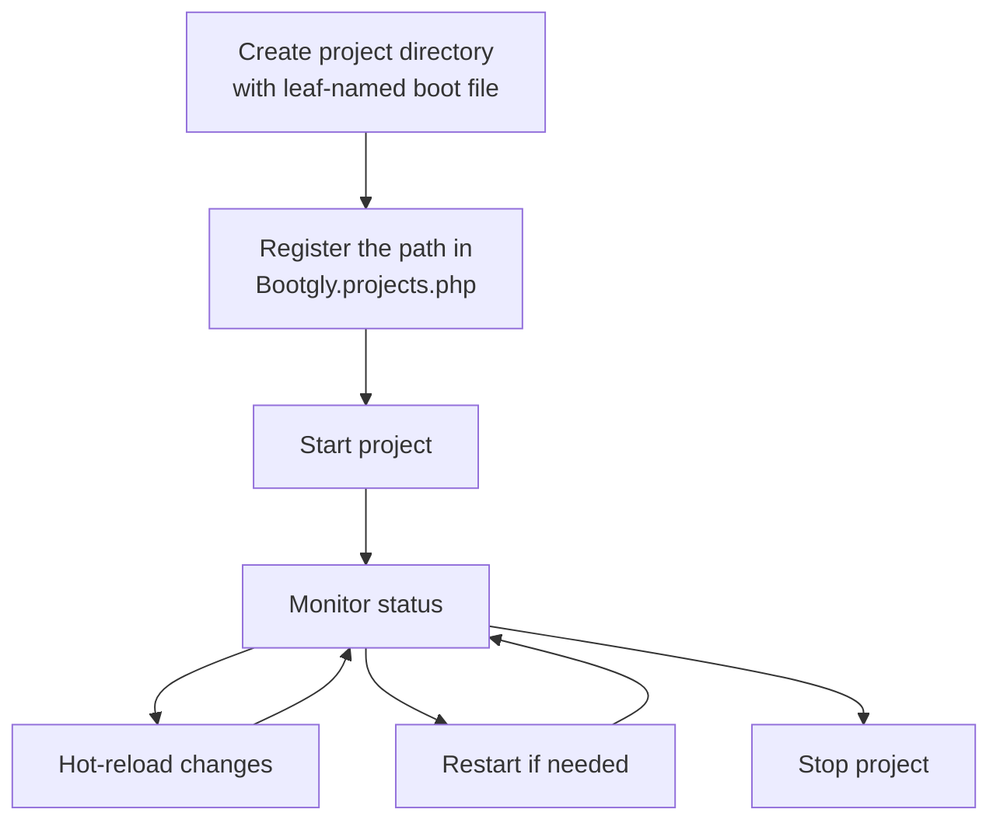

# Projects

Bootgly organizes applications as **projects** — self-contained directories inside `projects/` that contain a boot file. Each project declares its metadata (name, description, version, author) and a boot Closure that initializes the application.

A project can live at **any depth** inside `projects/`. A directory like `Demo/` can group several **subprojects** (`Demo/HTTP_Server_CLI`, `Demo/TCP_Server_CLI`, …), each started independently by its path. Projects are managed entirely through the `project` CLI command, which lists, runs, stops, inspects and hot-reloads them.

## Project structure

A project is a directory inside `projects/` (at any depth) containing a boot file named after its **leaf** folder — the convention is `{leaf}.project.php`. The file name matches the last path segment, not the full path.

```
projects/
├── Bootgly.projects.php          ← the registry (allow-list)
├── Site/                         ← a flat project (one path segment)
│   └── Site.project.php
└── Demo/                         ← a grouping folder (not a project itself)
    ├── HTTP_Server_CLI/
    │   └── HTTP_Server_CLI.project.php
    └── TCP_Server_CLI/
        └── TCP_Server_CLI.project.php
```

Here `Demo/HTTP_Server_CLI` and `Demo/TCP_Server_CLI` are two subprojects grouped under `Demo/`. `Demo/` itself has no `.project.php` — it is only a container.

### Boot file example

Each boot file returns a `Project` instance with metadata and a boot Closure:

```php
use Bootgly\API\Projects\Project;

return new Project(
   name: 'Generic Project',
   description: 'A generic Bootgly project example',
   version: '1.0.0',
   author: 'Your Name',
   exportable: true,

   boot: function (array $arguments = [], array $options = []): void
   {
      // Initialize and run your application here
   }
);
```

The constructor derives `path` (the absolute project directory) and `folder` (the project's path **relative to** `projects/`, e.g. `Demo/HTTP_Server_CLI`) automatically from the boot file's location — `folder` is the project's canonical identifier.

## The project registry

A single file at the root of `projects/` — **`Bootgly.projects.php`** — declares every registered project. It is both the interface map (which projects belong to CLI and/or WPI) **and the security boundary**: only paths listed here may be started or autobooted.

It returns a project-keyed map, kept in **alphabetical order by path**. Each key is a project's canonical path (relative to `projects/`); each value lists the `interfaces` it serves:

```php
<?php
return [
   'Demo/CLI'             => ['interfaces' => ['CLI']],
   'Demo/HTTP_Server_CLI' => ['interfaces' => ['WPI'], 'default' => true],
   'Demo/TCP_Server_CLI'  => ['interfaces' => ['WPI']],
   'Site'                 => ['interfaces' => ['CLI']],
];
```

A project that serves both interfaces lists both: `['interfaces' => ['CLI', 'WPI']]`. On the Web platform, the WPI entry flagged `'default' => true` is booted by default — the alphabetical file order does not affect this choice. If no entry is flagged, the first registered WPI project is used.

### Why an allow-list

Because projects can nest arbitrarily, an attacker who compromised your project tree could otherwise hide a rogue nested `.project.php` and have it executed. The registry closes that door: `bootgly project <path> start` runs **only** paths that are exact keys of `Bootgly.projects.php`. Anything else — an unregistered path, a grouping container (`Demo`), path traversal (`..`), an absolute path, a backslash or a null byte — is rejected, and the resolved directory is additionally jailed under the `projects/` base.

To make a new project runnable, use `bootgly project create` — it generates the directory, the boot file and the registry entry in one step. The registry file is machine-managed by `create`/`import` (entries are re-emitted sorted; hand-added comments inside the array are not preserved).

## Creating a project

`bootgly project create` is the canonical way to start a new project. On interactive terminals it opens a **wizard**:

```bash
php bootgly project create
```

The wizard prepares the kit on first run (platform submodules + `bootgly boot` resources), then asks for the creation mode:

- **From scratch** — a minimal `CLI` or `WPI` project generated from the framework stubs: it asks the project path, interface, port and metadata, shows a summary and confirms;
- **Importing platform projects** — a multi-selection over the **exportable** projects found in the platform folders (like the Demos): each selected project is recursively copied under its own path in your workspace's `projects/`, no questions asked. Existing user-level copies — which overwrite the platform ones on load — are flagged `(overwrite)` in the summary and refreshed.

Only projects declared with `exportable: true` in their `new Project(...)` signature appear in the import picker.

Non-interactively (CI, scripts, AI agents), everything comes from flags:

```bash
php bootgly project create App/API --from=scratch --interfaces=WPI --port=8080 --yes
php bootgly project create --from=Demo/HTTP_Server_CLI --yes
```

### The workspace, before and after

A freshly installed kit (what `curl -fsSL https://bootgly.com/install | bash` — or `git clone` + `git submodule update --init Bootgly` — leaves behind) contains only the **base platform** and the kit files:

```text
bootgly.kit/
├── Bootgly/            ← base platform (required git submodule)
│   ├── &/              ← internal framework resources
│   ├── @/              ← framework meta resources (certificates, static analysis, ...)
│   ├── Bootgly/        ← the framework itself — the I2P interfaces, in dependency order:
│   │   ├── ABI/        ← Configs/ Data/ Debugging/ Differ/ Events/ IO/ Resources/ Syntax/ Templates/
│   │   ├── ACI/        ← Events/ Fakers/ Logs/ Observability/ Process/ Queues/ Schedule/ Tests/
│   │   ├── ADI/        ← Database/ Databases/ Table/
│   │   ├── API/        ← Endpoints/ Environment/ Projects/ Security/ Workables/
│   │   ├── CLI/        ← Commands/ Terminal/ UI/
│   │   ├── WPI/        ← Connections/ Endpoints/ Events/ Interfaces/ Modules/ Nodes/ Queues/
│   │   └── commands/   ← built-in CLI commands (boot, demo, project, test, ...)
│   ├── configs/        ← framework configs
│   ├── docs/           ← framework docs assets
│   ├── projects/       ← author-level projects — the import sources (Benchmark/, Demo/, Example/)
│   ├── public/         ← resource template used by `bootgly boot`
│   ├── scripts/        ← resource template used by `bootgly boot`
│   ├── storage/        ← resource template used by `bootgly boot`
│   ├── tests/          ← resource template used by `bootgly boot`
│   ├── Bootgly.php     ← the framework root entity
│   ├── autoboot.php    ← framework autoboot (required by the kit launcher)
│   ├── bootgly         ← the framework's own CLI launcher
│   ├── composer.json
│   └── index.php
├── .gitignore
├── .gitmodules         ← Bootgly (required) + Console and Web (optional platforms)
├── LICENSE
├── README.md
├── bootgly             ← the CLI launcher (autoboots Bootgly + the optional platforms)
├── composer.json
└── index.php           ← the Web front controller
```

`Console/` and `Web/` exist only as empty submodule entries at this point. The wizard's first run initializes the chosen platform submodules and runs `bootgly boot` to install your own resource folders:

```text
bootgly.kit/
├── Bootgly/            ← base platform (submodule — expanded above)
├── Console/            ← Console platform (initialized by the wizard)
├── Web/                ← Web platform (initialized when chosen)
├── projects/           ← YOUR projects — installed by `bootgly boot`
│   ├── Benchmark/      ← exportable: false — hidden from the import picker
│   ├── Demo/           ← exportable: true — importable / refreshable by the wizard
│   ├── Example/
│   └── Bootgly.projects.php   ← the consumer registry (allow-list, machine-managed)
├── public/             ← installed by `bootgly boot`
├── scripts/            ← installed by `bootgly boot`
├── storage/            ← installed by `bootgly boot` (cache/, logs/, pids/)
├── tests/              ← installed by `bootgly boot`
├── .gitignore
├── .gitmodules
├── LICENSE
├── README.md
├── bootgly             ← now autoboots Bootgly + Console (+ Web) through the conditional chain
├── composer.json
└── index.php
```

Everything you own lives at the workspace level — `projects/`, `public/`, `storage/` — while the platforms stay untouched inside their submodules. When a project exists both in your `projects/` and in a platform's, **your copy wins on load**: that is why re-importing a platform project simply refreshes your copy.

## Importing a project

Any directory carrying the **Bootgly project signature** — a `*.project.php` file at its root — is an importable project. `bootgly project import` fetches one from a git repository URL:

```bash
php bootgly project import https://github.com/foo/project1 Project1
```

The repository is cloned (system git), validated against the signature, copied into `projects/Project1/` (the signature file is renamed to the new leaf) and registered in the allow-list.

> [!WARNING]
> Imported projects run third-party code when started — the command asks for confirmation (skip with `--yes`).

## The `project` command

The `project` command is the central tool for managing Bootgly projects. Run `php bootgly project` to see all subcommands:



### `project create`

Creates a new project — wizard on interactive terminals, flags otherwise:

```bash
php bootgly project create [<Name>] [--platform=console|web] [--from=scratch|<source>] \
   [--interfaces=CLI|WPI] [--port=] [--description=] [--version=] [--author=] [--default] [--yes]
```

- `--platform` — platform to set up on the kit's first run (initializes the `Console`/`Web` submodules and runs `bootgly boot`);
- `--from` — `scratch` (default) or a platform project path (e.g. `Demo/HTTP_Server_CLI`). Platform imports keep their own path (`<Name>` is optional) and refresh an existing copy;
- `--interfaces` — interface bound to a from-scratch project (`CLI` default);
- `--default` — flags the entry as the Web (WPI) autoboot default;
- `--yes` — skips confirmations.

### `project import`

Imports a project from a git repository URL carrying the `*.project.php` signature:

```bash
php bootgly project import <url> [<Name>] [--interfaces=CLI|WPI] [--default] [--yes]
```

### `project list`

Lists every registered project, grouped by interface (CLI, WPI or both):

```bash
php bootgly project list
```

Example output:

```
 Project list:

 #1  - Benchmark
    Description: Benchmarking project for Bootgly's
    Type: CLI

 #2  - Demo/HTTP_Server_CLI
    Description: Demonstration project for Bootgly HTTP Server CLI
    Type: WPI
```

### `project start`

Boots a project by its path:

```bash
# Run a subproject by its path
php bootgly project Demo/HTTP_Server_CLI start

# Run in interactive mode
php bootgly project Demo/HTTP_Server_CLI start -i

# Run in monitor mode
php bootgly project Demo/HTTP_Server_CLI start -m
```

You can reverse the order of the arguments (subcommand first):

```bash
php bootgly project start Demo/HTTP_Server_CLI
php bootgly project stop Demo/HTTP_Server_CLI
```

Available options:

| Option | Description |
|--------|-------------|
| `-d` | Run in daemon mode (default) |
| `-i` | Run in interactive mode |
| `-m` | Run in monitor mode |

### `project stop`

Stops a running project by sending SIGTERM to the master process. If the process does not terminate within 5 seconds, it sends SIGKILL:

```bash
php bootgly project Demo/HTTP_Server_CLI stop
```

This stops **all running instances** of the project (primary and any named instances like test servers).

### `project show`

Shows the current status of a running project, including PID, workers, address and uptime:

```bash
php bootgly project Demo/HTTP_Server_CLI show
```

Example output:

```
┌─ Project Status ────────────────────┐
│ Project        Demo/HTTP_Server_CLI │
│ Type           WPI                  │
│ Status         running              │
│ Master PID     12345                │
│ Workers        11/11                │
│ Address        0.0.0.0:8082         │
│ Uptime         2h 15m 30s           │
└─────────────────────────────────────┘
```

### Process state (PID files)

When a project starts, it saves its process state (master PID, worker PIDs, type, etc.) in a JSON file under `storage/pids/`. The file is named after the project's canonical path, with `/` encoded as `~` so nested leaves never collide — running `Demo/HTTP_Server_CLI` creates `storage/pids/Demo~HTTP_Server_CLI.json`.

For named instances (like test servers), the file gains an instance qualifier: `Demo~HTTP_Server_CLI.test.json`. The `project stop` and `project show` commands automatically discover all instances (primary + named) for a given project path.

### `project reload`

Sends a hot-reload signal (SIGUSR2) to a running project, allowing it to reload its code without a full restart:

```bash
php bootgly project Demo/HTTP_Server_CLI reload
```

### `project restart`

Stops and then starts a project again. Accepts the same options as `project start`:

```bash
php bootgly project Demo/HTTP_Server_CLI restart
```

### `project info`

Displays detailed metadata about a project in a Fieldset:

```bash
php bootgly project Demo/HTTP_Server_CLI info
```

Example output:

```
┌─ Project Info ──────────────────────────────────────────────────────┐
│ Name           Demo HTTP Server CLI                                │
│ Folder         Demo/HTTP_Server_CLI                                │
│ Description    Demonstration project for Bootgly HTTP Server CLI   │
│ Version        1.0.0                                               │
│ Author         Bootgly                                             │
│ Interfaces     WPI                                                 │
│ Path           /path/to/projects/Demo/HTTP_Server_CLI             │
└─────────────────────────────────────────────────────────────────────┘
```

## Project lifecycle

The typical lifecycle of a project follows this flow:



1. **Create** a directory in `projects/` (at any depth) with a `{leaf}.project.php` boot file;
2. **Register** its path in `Bootgly.projects.php` under the right interface(s);
3. **Run** it with `project start`;
4. **Monitor** its status with `project show`;
5. **Reload** code changes with `project reload` (sends SIGUSR2);
6. **Restart** completely if needed with `project restart`;
7. **Stop** it with `project stop`.

## Built-in projects

Bootgly ships with example projects under `projects/`:

| Project | Interface | Description |
|---------|-----------|-------------|
| `Demo/CLI` | CLI | Interactive CLI demo for terminal components |
| `Demo/HTTP_Server_CLI` | WPI | HTTP server demo with routing, ORM and observability routes |
| `Demo/HTTPS_Server_CLI` | WPI | HTTPS server demo |
| `Demo/TCP_Server_CLI` | WPI | Raw TCP server with configurable workers |
| `Demo/Queue-HTTP_Server_CLI` | WPI | HTTP server that enqueues background jobs |
| `Benchmark/HTTP_Server_CLI` | WPI | HTTP server benchmark (simple/techempower/bootgly routers) |
| `Benchmark/TCP_Server_CLI` | WPI | Raw TCP server benchmark (HTTP or echo) |
| `Benchmark/UDP_Server_CLI` | WPI | Raw UDP echo server benchmark |
