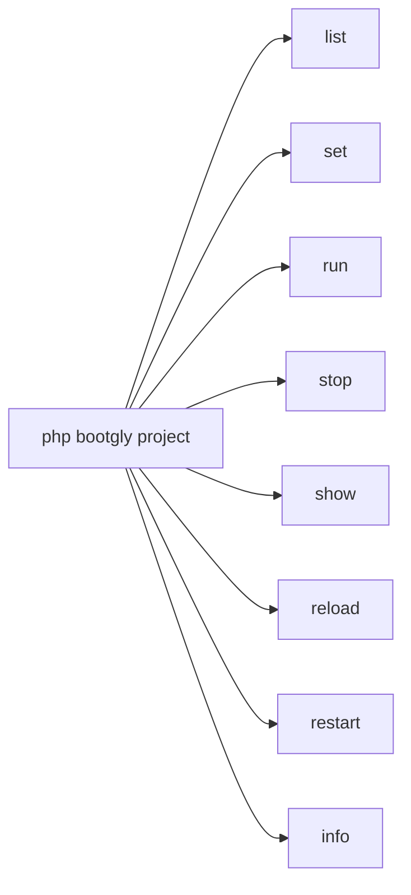
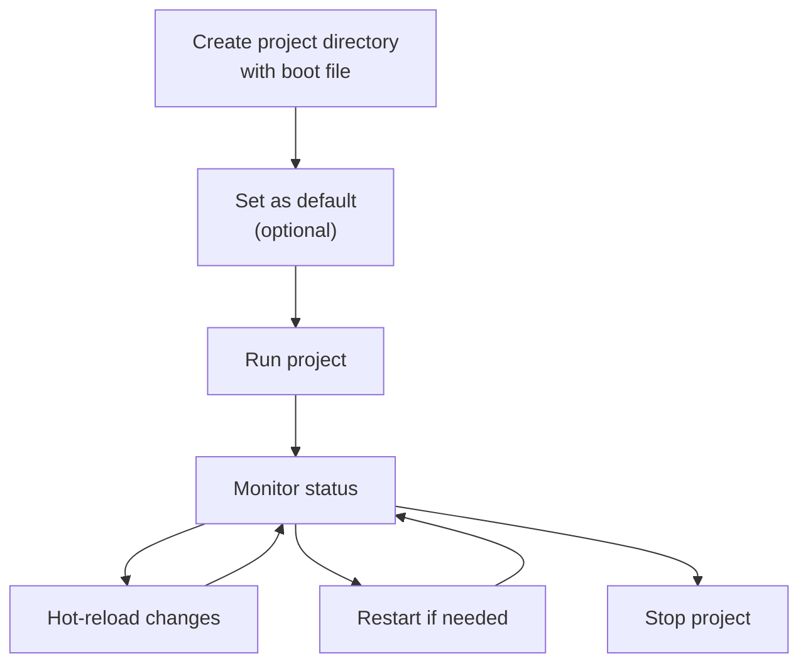

# Projects

Bootgly organizes applications as **projects** — self-contained directories inside `projects/` that contain one or more boot files. Each project declares its metadata (name, description, version, author) and a boot Closure that initializes the application.

Projects are managed entirely through the `project` CLI command, which provides subcommands for listing, running, stopping, inspecting and hot-reloading projects.

## Project structure

A project is a directory inside `projects/` with a boot file. The boot file follows the naming convention `{project_folder_name}.project.php` — the file name must match the project folder name.

For example, a project in the folder `HTTP_Server_CLI` must have its boot file named `HTTP_Server_CLI.project.php`:

```
projects/
├── HTTP_Server_CLI/
│   └── HTTP_Server_CLI.project.php
├── Demo_CLI/
│   └── Demo_CLI.project.php
└── @.php
```

### Boot file example

Each boot file returns a `Project` instance with metadata and a boot Closure:

```php
use Bootgly\API\Projects\Project;

return new Project(
   name: 'My HTTP Server',
   description: 'A web server with routing and middlewares',
   version: '1.0.0',
   author: 'Your Name',

   boot: function (array $arguments = [], array $options = []): void
   {
      // Initialize and run your application here
   }
);
```

The `Project` class accepts the following properties:

| Property | Type | Description |
|----------|------|-------------|
| `name` | string | Display name of the project |
| `description` | string | Brief description |
| `version` | string | Semantic version |
| `author` | string | Author name |
| `boot` | Closure | The boot function that initializes the application |

### Default project

The file `projects/@.php` defines which project is the default:

```php
<?php
return [
   'default' => 'HTTP_Server_CLI'
];
```

## The `project` command

The `project` command is the central tool for managing Bootgly projects. Run `php bootgly project` to see all available subcommands:



### `project list`

Discovers and lists all projects in the `projects/` directory, showing their interfaces (CLI, WPI or both) and marking the default project:

```bash
php bootgly project list
```

Example output:

```
 Project list:

 #1  - HTTP Server CLI (projects/HTTP_Server_CLI) [WPI] [default]
       HTTP server demo with static/dynamic routing and catch-all 404
 #2  - Demo CLI (projects/Demo_CLI) [CLI]
       Interactive CLI demo for Bootgly terminal components
 #3  - TCP Server CLI (projects/TCP_Server_CLI) [WPI]
 #4  - TCP Client CLI (projects/TCP_Client_CLI) [CLI]
```

### `project set`

Sets project properties. Currently supports setting the default project:

```bash
php bootgly project set HTTP_Server_CLI --default
```

This updates `projects/@.php` so that `project run` (without arguments) will boot the specified project.

### `project run`

Boots a project by name or the default project:

```bash
# Run a specific project
php bootgly project run HTTP_Server_CLI

# Run only CLI demo
php bootgly project run Demo_CLI

# Run in interactive mode
php bootgly project run HTTP_Server_CLI -it

# Run in monitor mode
php bootgly project run HTTP_Server_CLI -m
```

Available options:

| Option | Description |
|--------|-------------|
| `-d` | Run in daemon mode (default) |
| `-it` | Run in interactive mode |
| `-m` | Run in monitor mode |

### `project stop`

Stops a running project by sending SIGTERM to the master process. If the process does not terminate within 5 seconds, it sends SIGKILL:

```bash
# Stop a named project
php bootgly project stop HTTP_Server_CLI
```

### `project show`

Shows the current status of a running project, including PID, workers, address and uptime:

```bash
php bootgly project show HTTP_Server_CLI
```

Example output:

```
┌─ Project Status ────────────────────┐
│ Project        HTTP_Server_CLI      │
│ Type           WPI                  │
│ Status         running              │
│ Master PID     12345                │
│ Workers        11/11                │
│ Address        0.0.0.0:8082         │
│ Uptime         2h 15m 30s           │
└─────────────────────────────────────┘
```

### `project reload`

Sends a hot-reload signal (SIGUSR2) to a running project, allowing it to reload its code without a full restart:

```bash
php bootgly project reload HTTP_Server_CLI
```

### `project restart`

Stops and then starts a project again. Accepts the same options as `project run`:

```bash
php bootgly project restart HTTP_Server_CLI
```

### `project info`

Displays detailed metadata about a project in a Fieldset:

```bash
php bootgly project info HTTP_Server_CLI
```

Example output:

```
┌─ Project Info ──────────────────────────────────────────────────────┐
│ Name           HTTP Server CLI                                     │
│ Folder         HTTP_Server_CLI                                     │
│ Description    HTTP server demo with static/dynamic routing        │
│ Version        0.1.0                                               │
│ Author         Rodrigo Vieira                                      │
│ Interfaces     WPI                                                 │
│ Path           /path/to/projects/HTTP_Server_CLI                   │
└─────────────────────────────────────────────────────────────────────┘
```

## Project lifecycle

The typical lifecycle of a project follows this flow:



1. **Create** a directory in `projects/` with a `*.project.php` boot file;
2. **Set** it as default (optional) with `project set <name> --default`;
3. **Run** it with `project run`;
4. **Monitor** its status with `project show`;
5. **Reload** code changes with `project reload` (sends SIGUSR2);
6. **Restart** completely if needed with `project restart`;
7. **Stop** it with `project stop`.

## Built-in projects

Bootgly ships with several example projects in the `projects/` directory:

| Project | Interface | Description |
|---------|-----------|-------------|
| `HTTP_Server_CLI` | WPI | HTTP server demo with static/dynamic routing and catch-all 404 |
| `Demo_CLI` | CLI | Interactive CLI demo for terminal components (22 demos) |
| `TCP_Server_CLI` | WPI | Raw TCP server with configurable workers |
| `TCP_Client_CLI` | CLI | TCP client benchmark (write/read stress test) |