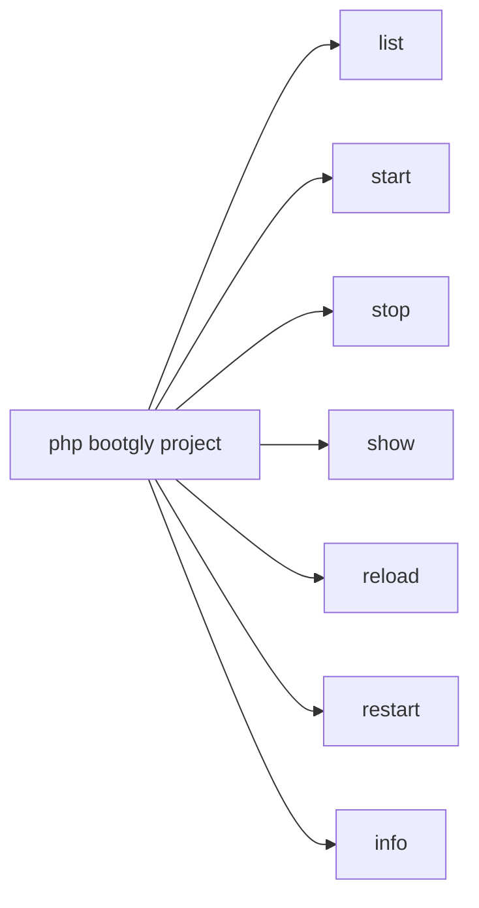
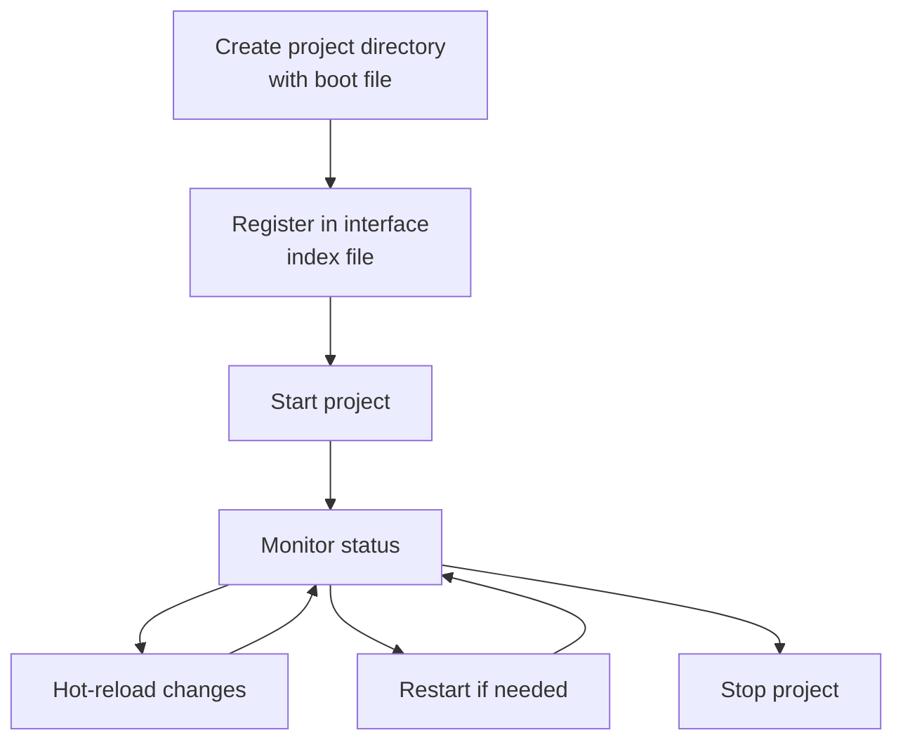

# Projects

Bootgly organizes applications as **projects** — self-contained directories inside `projects/` that contain one or more boot files. Each project declares its metadata (name, description, version, author) and a boot Closure that initializes the application.

Projects are managed entirely through the `project` CLI command, which provides subcommands for listing, running, stopping, inspecting and hot-reloading projects.

## Project structure

A project is a directory inside `projects/` with a boot file. The boot file follows the naming convention `{project_folder_name}.project.php` — the file name must match the project folder name.

For example, a project in the folder `Sample_Project` must have its boot file named `Sample_Project.project.php`:

```
projects/
├── WPI.projects.php
├── CLI.projects.php
├── Sample_Project/
│   └── Sample_Project.project.php
└── Another_Project/
    └── Another_Project.project.php
```

### Boot file example

Each boot file returns a `Project` instance with metadata and a boot Closure:

```php
use Bootgly\API\Projects\Project;

return new Project(
   name: 'Generic Project',
   description: 'A generic Bootgly project example',
   version: '1.0.0',
   author: 'Your Name',

   boot: function (array $arguments = [], array $options = []): void
   {
      // Initialize and run your application here
   }
);
```

The `Project` class accepts the following properties:

| Property | Type | Description |
|----------|------|-------------|
| `name` | string | Display name of the project |
| `description` | string | Brief description |
| `version` | string | Semantic version |
| `author` | string | Author name |
| `boot` | Closure | The boot function that initializes the application |

### Interface index files

Each interface has an index file at the root of `projects/` that lists the projects belonging to that interface:

**`WPI.projects.php`** — Web projects (HTTP servers, TCP, etc.):

```php
<?php
return [
   'HTTP_Server_CLI',
   'TCP_Server_CLI',
   'TCP_Client_CLI'
];
```

**`CLI.projects.php`** — CLI projects:

```php
<?php
return [
   'Demo_CLI'
];
```

When `bootgly project list` is executed, these indexes are read to determine each project's interface(s).

## The `project` command

The `project` command is the central tool for managing Bootgly projects. Run `php bootgly project` to see all available subcommands:



### `project list`

Discovers and lists all projects in the `projects/` directory, showing their interfaces (CLI, WPI or both) and marking the default project:

```bash
php bootgly project list
```

Example output:

```
 Project list:

 #1  - Generic Project (projects/Sample_Project) [CLI]
    Generic project example for Bootgly docs

 #2  - Another Project (projects/Another_Project) [WPI]
```

### `project start`

Boots a project by name:

```bash
# Run a specific project
php bootgly project start Sample_Project

# Run another project
php bootgly project start Another_Project

# Run in interactive mode
php bootgly project start Sample_Project -i

# Run in monitor mode
php bootgly project start Sample_Project -m
```

You can reverse the order of the arguments to have both options for passing subcommands to the same project or passing multiple projects to the same subcommand:

```bash
# Run a specific project
php bootgly project Sample_Project start
# Run another project
php bootgly project Another_Project start
# Run in interactive mode
php bootgly project Sample_Project start -i
# Stop the same project
php bootgly project Sample_Project stop
```

Available options:

| Option | Description |
|--------|-------------|
| `-d` | Run in daemon mode (default) |
| `-i` | Run in interactive mode |
| `-m` | Run in monitor mode |

### `project stop`

Stops a running project by sending SIGTERM to the master process. If the process does not terminate within 5 seconds, it sends SIGKILL:

```bash
# Stop a named project
php bootgly project stop Sample_Project
```

This command stops **all running instances** of the project (primary and any named instances like test servers).

### `project show`

Shows the current status of a running project, including PID, workers, address and uptime:

```bash
php bootgly project show Sample_Project
```

If the project has multiple running instances (e.g. a production server and a test server), all instances are displayed:

Example output:

```
┌─ Project Status ────────────────────┐
│ Project        Sample_Project       │
│ Type           WPI                  │
│ Status         running              │
│ Master PID     12345                │
│ Workers        11/11                │
│ Address        0.0.0.0:8082         │
│ Uptime         2h 15m 30s           │
└─────────────────────────────────────┘

┌─ Project Status ────────────────────┐
│ Project        Sample_Project.test  │
│ Type           WPI                  │
│ Status         running              │
│ Master PID     12400                │
│ Workers        1/1                  │
│ Address        0.0.0.0:8080         │
│ Uptime         0h 5m 12s            │
└─────────────────────────────────────┘
```

### Process state (PID files)

When a project starts, it saves its process state (master PID, worker PIDs, type, etc.) in a JSON file under `workdata/pids/`. The file is named after the **project folder name** — for example, running `HTTP_Server_CLI` creates `workdata/pids/HTTP_Server_CLI.json`.

For named instances (like test servers), the file includes an instance qualifier: `HTTP_Server_CLI.test.json`. This allows multiple instances of the same project to coexist without PID file conflicts.

The `project stop` and `project show` commands automatically discover all instances (primary + named) for a given project name.

### `project reload`

Sends a hot-reload signal (SIGUSR2) to a running project, allowing it to reload its code without a full restart:

```bash
php bootgly project reload Sample_Project
```

### `project restart`

Stops and then starts a project again. Accepts the same options as `project start`:

```bash
php bootgly project restart Sample_Project
```

### `project info`

Displays detailed metadata about a project in a Fieldset:

```bash
php bootgly project info Sample_Project
```

Example output:

```
┌─ Project Info ──────────────────────────────────────────────────────┐
│ Name           Generic Project                                     │
│ Folder         Sample_Project                                      │
│ Description    A generic Bootgly project example                   │
│ Version        0.1.0                                               │
│ Author         Your Name                                           │
│ Interfaces     CLI                                                 │
│ Path           /path/to/projects/Sample_Project                    │
└─────────────────────────────────────────────────────────────────────┘
```

## Project lifecycle

The typical lifecycle of a project follows this flow:



1. **Create** a directory in `projects/` with a `*.project.php` boot file;
2. **Register** it in the interface index file (`WPI.projects.php` or `CLI.projects.php`);
3. **Run** it with `project start`;
4. **Monitor** its status with `project show`;
5. **Reload** code changes with `project reload` (sends SIGUSR2);
6. **Restart** completely if needed with `project restart`;
7. **Stop** it with `project stop`.

## Built-in projects

Bootgly ships with several example projects in the `projects/` directory:

| Project | Interface | Description |
|---------|-----------|-------------|
| `Demo_CLI` | CLI | Interactive CLI demo for terminal components (22 demos) |
| `HTTP_Server_CLI` | WPI | HTTP server demo with static/dynamic routing and catch-all 404 |
| `TCP_Server_CLI` | WPI | Raw TCP server with configurable workers |
| `TCP_Client_CLI` | CLI | TCP client benchmark (write/read stress test) |