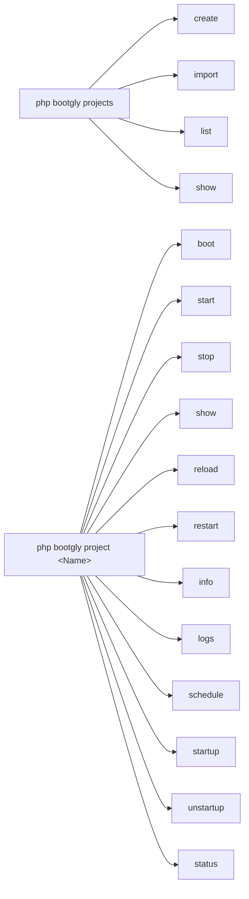
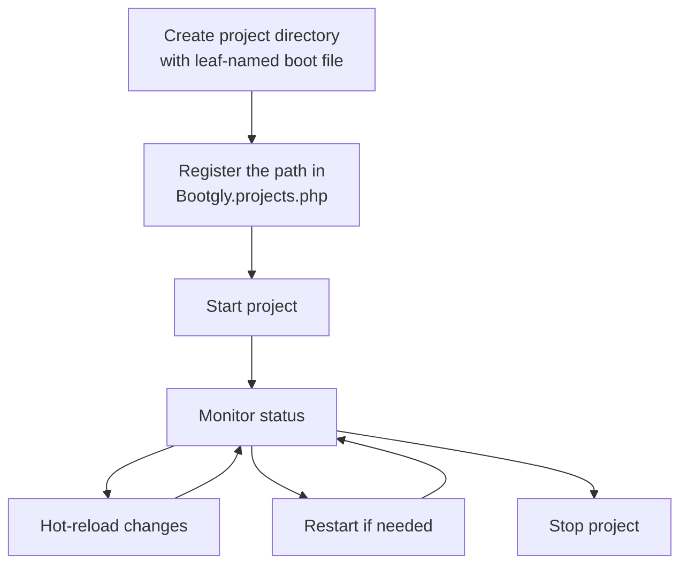

# Projects

Bootgly organizes applications as **projects** — self-contained directories inside `projects/` that contain a boot file. Each project declares its metadata (name, description, version, author) and a boot Closure that initializes the application.

A project can live at **any depth** inside `projects/`. A directory like `Demo/` can group several **subprojects** (`Demo/HTTP_Server_CLI`, `Demo/TCP_Server_CLI`, …), each started independently by its path. Projects are managed entirely through the `project` CLI command, which lists, runs, stops, inspects and hot-reloads them.

## Project structure

A project is a directory inside `projects/` (at any depth) containing a boot file named after its **leaf** folder — the convention is `{leaf}.Project.php`. The file name matches the last path segment, not the full path.

```
projects/
├── Bootgly.projects.php          ← the registry (allow-list)
├── Site/                         ← a flat project (one path segment)
│   └── Site.Project.php
└── Demo/                         ← a grouping folder (not a project itself)
    ├── HTTP_Server_CLI/
    │   └── HTTP_Server_CLI.Project.php
    └── TCP_Server_CLI/
        └── TCP_Server_CLI.Project.php
```

Here `Demo/HTTP_Server_CLI` and `Demo/TCP_Server_CLI` are two subprojects grouped under `Demo/`. `Demo/` itself has no `.Project.php` — it is only a container.

### Boot file example

Each boot file returns a `Project` instance with metadata and a boot Closure:

```php
use Bootgly\API\Projects\Project;

return new Project(
   name: 'Generic Project',
   description: 'A generic Bootgly project example',
   version: '1.0.0',
   author: 'Your Name',
   exportable: true,

   boot: function (array $arguments = [], array $options = []): void
   {
      // Initialize and run your application here
   }
);
```

The constructor derives `path` (the absolute project directory) and `folder` (the project's path **relative to** `projects/`, e.g. `Demo/HTTP_Server_CLI`) automatically from the boot file's location — `folder` is the project's canonical identifier.

## The project registry

A single file at the root of `projects/` — **`Bootgly.projects.php`** — declares every registered project. It is both the interface map (which projects belong to CLI and/or WPI) **and the security boundary**: only paths listed here may be started.

It returns a project-keyed map, kept in **alphabetical order by path**. Each key is a project's canonical path (relative to `projects/`); each value lists the `interfaces` it serves:

```php
<?php
return [
   'Demo/CLI'             => ['interfaces' => ['CLI']],
   'Demo/HTTP_Server_CLI' => ['interfaces' => ['WPI']],
   'Demo/TCP_Server_CLI'  => ['interfaces' => ['WPI']],
   'Site'                 => ['interfaces' => ['CLI']],
];
```

A project that serves both interfaces lists both: `['interfaces' => ['CLI', 'WPI']]`. Web projects are served by Bootgly's own CLI HTTP server and are always started by name (`bootgly project <path> start`) — there is no web SAPI mode and no autoboot default.

### Why an allow-list

Because projects can nest arbitrarily, an attacker who compromised your project tree could otherwise hide a rogue nested `.Project.php` and have it executed. The registry closes that door: `bootgly project <path> start` runs **only** paths that are exact keys of `Bootgly.projects.php`. Anything else — an unregistered path, a grouping container (`Demo`), path traversal (`..`), an absolute path, a backslash or a null byte — is rejected, and the resolved directory is additionally jailed under the `projects/` base.

To make a new project runnable, use `bootgly projects create` — it generates the directory, the boot file and the registry entry in one step. The registry file is machine-managed by `create`/`import` (entries are re-emitted sorted; hand-added comments inside the array are not preserved).

Every value is re-emitted as an escaped PHP literal, the file is parse-verified before it is installed and the write is atomic — so no project name or metadata can leave the registry unparseable. Paths minted by `create`/`import` follow a naming alphabet: each segment starts uppercase and uses only letters, numbers, `_` or `-` (e.g. `App` or `App/API`). A path that was hand-registered before that rule keeps working — the allow-list check is the boundary, not the alphabet.

## Creating a project

`bootgly projects create` is the canonical way to start a new project. On interactive terminals it opens a **wizard**:

```bash :toolbar="true";
php bootgly projects create
```

The wizard prepares the kit on first run — every platform submodule (`Console` and `Web`), the `bootgly kit boot` resources and the shipped examples, none of it asked — then asks for the creation mode:

- **Using what is already imported** — the first mode creates nothing. A prepared kit already carries every exportable platform project, so standing pat and opening one of them is a first-class way to start; the option states how many the kit holds;
- **From scratch** — a minimal `CLI` or `WPI` project generated from the framework stubs: it asks the project path, interface, port and metadata, shows a summary and confirms;
- **Importing from a Git remote** — it asks the repository URL, the target path and the interface, then delegates to `bootgly projects import`: the repository is cloned, validated against the `*.Project.php` signature and registered.

Only projects declared with `exportable: true` in their `new Project(...)` signature are stocked as examples or copied by `--from=<source>`.

Non-interactively (CI, scripts, AI agents), everything comes from flags:

```bash
php bootgly projects create App/API --from=scratch --interfaces=WPI --port=8080 --yes
php bootgly projects create --from=Demo/HTTP_Server_CLI --yes
```

**Every project you create is booted — a git repository of its own.** `create`
runs the `bootgly project <Name> boot` hook: the scaffold — the project
signature, a `tests/` registry with an example suite and a `.gitignore`
(ignoring `/vendor/`) — lands as one initial commit, so `git log`, branches
and a remote of your choosing work from minute one. `--no-git` skips the hook;
on a machine with no git identity configured, the repository is left
initialized with the scaffold staged and nothing is committed in your name. A
nested project (e.g. `App/API` inside `App`) joins its parent's repository
instead of nesting one.

The **shipped platform examples** — the Demos, the Console games and the Web
apps — are imported automatically when the kit is prepared (first boot, and
whenever a platform is initialized), so a fresh kit always carries living
guides for people and AI agents alike. They arrive **unbooted** — they are
guides, not your work; adopt one with `php bootgly project <Name> boot`. An
example you delete stays deleted. The kit itself never tracks `projects/` —
each project is the unit of versioning, and **Composer is per project too**:
run `composer require` inside `projects/<Name>/`, and the framework loads that
project's `vendor/autoload.php` when the project boots.

## Importing a project

Any directory carrying the **Bootgly project signature** — a `*.Project.php` file at its root — is an importable project. `bootgly projects import` fetches one from a git repository URL:

```bash :toolbar="true";
php bootgly projects import https://github.com/foo/project1 Project1
```

The repository is cloned (system git) with its **full history**, validated against the signature, placed into `projects/Project1/` — `.git`, `origin` remote and all, so you keep committing and pushing from there — and registered in the allow-list. When the target name differs from the source's, the signature file is renamed to the new leaf and left **uncommitted** for you to review. Every rule the registry enforces is checked before the copy, so a refused import leaves nothing behind.

> [!WARNING]
> Imported projects run third-party code when started — the command asks for confirmation (skip with `--yes`).

## The `projects` and `project` commands

Two commands split the work by what they address. `projects` is the kit as a whole — the registry (`create`, `import`, `list`) and what is running across it (`show`); `project <Name>` is one project you name. Run `php bootgly projects` or `php bootgly project` to see the subcommands of each:


```mermaid
graph LR
  projects["php bootgly projects"]
  projects --> create["create"]
  projects --> import["import"]
  projects --> list["list"]
  projects --> ps["show"]
  project["php bootgly project &lt;Name&gt;"]
  project --> boot["boot"]
  project --> start["start"]
  project --> stop["stop"]
  project --> show["show"]
  project --> reload["reload"]
  project --> restart["restart"]
  project --> info["info"]
  project --> logs["logs"]
  project --> schedule["schedule"]
  project --> startup["startup"]
  project --> unstartup["unstartup"]
  project --> status["status"]
```

### `projects create`

Creates a new project — wizard on interactive terminals, flags otherwise:

```bash
php bootgly projects create [<Name>] [--platform=console,web] [--from=scratch|<source>] \
   [--interfaces=CLI|WPI] [--port=] [--description=] [--version=] [--author=] [--yes]
```

- `--platform` — narrows what the kit's first run sets up, comma-separated. Every platform is set up by default (`Console` and `Web` submodules initialized, `bootgly kit boot` run, shipped examples imported), so this flag only matters when you want less: `--platform=console` for one of them, `--platform=none` for the base platform alone. A later run only ever sets up what it names — a platform you removed stays removed;
- `--from` — `scratch` (default) or a platform project path (e.g. `Demo/HTTP_Server_CLI`). Platform imports keep their own path (`<Name>` is optional) and refresh an existing copy — the new copy is built beside the old one and swapped in only once it is complete. Only a project copy (a directory with a `*.Project.php` at its root) is refreshed; a group of projects or a hand-made directory at that path is refused, never replaced;
- `--interfaces` — interface bound to a from-scratch project (`CLI` default);
- `--port` — HTTP port written into a from-scratch WPI project file (`8080` default); a number between 1 and 65535, refused otherwise;
- `--description`, `--version`, `--author` — metadata written into the project file; quotes and backslashes are stored safely, control characters are refused;
- `--yes` — skips confirmations;
- `--no-git` — skips the boot hook (the project's own git repository, created and committed by default on from-scratch creates);
- `--refresh` — with `--from=<source>`, replaces a target that is already a git repository. Without it the command refuses: a repository in `projects/` is your only copy of that history.

A name you pass to `create` is yours: a shipped example that would take the same path is left unstocked, so the first command on a new kit never loses to a name you have not seen.

### `project boot`

Boots a project — initializes the resources a project of your own carries. Today that is version control (a git repository of its own, with the current tree as the initial commit); more responsibilities will land here as the project lifecycle grows:

```bash
php bootgly project <Name> boot
```

`projects create` runs the same hook for every from-scratch project. The shipped platform examples arrive unbooted; this subcommand is how you adopt one. A URL import brings its own repository and history along. Best-effort by design: a disabled shell, a missing git or an unset identity degrades to a note, never to a failure.

### `projects import`

Imports a project from a git repository URL carrying the `*.Project.php` signature. Without arguments, interactive terminals choose the import source first — the Platforms (a multi-selection showing how many exportable projects are available) or a Git remote (asks the URL):

```bash
php bootgly projects import <url> [<Name>] [--interfaces=CLI|WPI] [--yes]
```

### `projects list`

Lists every registered project — one row each, with the interfaces the registry binds it to and the description its signature carries. The description is clipped to the terminal width, never wrapped:

```bash :toolbar="true";
php bootgly projects list
```

Example output:

```
╔═════╤══════════════════════╤════════════╤═══════════════════════════════════════════════════════╗
║ #   │ Project              │ Interface  │ Description                                           ║
╟─────┼──────────────────────┼────────────┼───────────────────────────────────────────────────────╢
║ 1   │ App/API              │ WPI        │ Orders API                                            ║
║ 2   │ Demo/CLI             │ CLI        │ Demonstration project for Bootgly CLI features        ║
║ 3   │ Demo/HTTP_Server_CLI │ WPI        │ Demonstration project for Bootgly HTTP Server CLI     ║
╚═════╧══════════════════════╧════════════╧═══════════════════════════════════════════════════════╝
```

### `projects show`

Shows every **running instance** across the registered projects — the `ps` of the kit. One line per instance, never per project: a project can hold several (one per bound port for servers, one per master PID for console and schedule workers), and the instance is what you address by port in `stop`/`reload` or with `--instance` in `logs`:

```bash :toolbar="true";
php bootgly projects show
```

Example output:

```
╔══════════════════════╤══════════╤═══════════╤═════════╤════════╤═════════╤════════╤══════════════╤═════╗
║ Project              │ Instance │ Interface │ Status  │ Master │ Workers │ Uptime │ Address      │ Tap ║
╟──────────────────────┼──────────┼───────────┼─────────┼────────┼─────────┼────────┼──────────────┼─────╢
║ Demo/HTTP_Server_CLI │ 8080     │ WPI       │ running │ 41230  │ 4       │ 2h 15m │ 0.0.0.0:8080 │ yes ║
║ App/API              │ 8443     │ WPI       │ paused  │ 41301  │ 4       │ 2h 14m │ 0.0.0.0:8443 │ yes ║
║ App/API              │ 41988    │ CLI       │ running │ 41988  │ -       │ 5m 12s │ -            │ -   ║
╚══════════════════════╧══════════╧═══════════╧═════════╧════════╧═════════╧════════╧══════════════╧═════╝
```

Liveness is the instance lock — the same proof `project <Name> show` uses — so a state file left behind by a crash never shows as running. `Tap` says whether the instance publishes the live-log socket that `logs -f` attaches to. On a narrow terminal the table gives up its secondary columns first — `Tap`, `Workers`, `Master`, `Interface`, then `Address` and `Uptime` — the way `pm2 ps` does; `Project`, `Instance` and `Status` always stay, and `--json` always carries every field. Two flags:

- `--all` — also lists what is still on record but no longer running (`stopped`): the tombstone a clean stop leaves, or a document whose master is gone;
- `--json` — one JSON document with the same rows (`project`, `instance`, `interface`, `status`, `master`, `workers`, `uptime` in seconds, `address`, `tap`), for scripts and agents.

Nothing running prints `No running instance found.` — plus, when state files exist that this user cannot verify, a tip naming the service account that started them.

### `project start`

Boots a project by its path:

```bash
# Run a subproject by its path
php bootgly project Demo/HTTP_Server_CLI start

# Run in interactive mode
php bootgly project Demo/HTTP_Server_CLI start -i

# Run in monitor mode
php bootgly project Demo/HTTP_Server_CLI start -m
```

You can reverse the order of the arguments (subcommand first):

```bash
php bootgly project start Demo/HTTP_Server_CLI
php bootgly project stop Demo/HTTP_Server_CLI
```

Available options:

| Option | Description |
|--------|-------------|
| `-d` | Run in daemon mode (default) |
| `-i` | Run in interactive mode |
| `-m` | Run in monitor mode |

#### Multiple instances

A server project can run **multiple instances at once** — one per port. The bound port is the instance qualifier, so start extra instances by overriding the `PORT` environment variable:

```bash
php bootgly project start Blog             # instance on the project's default port (8080)
PORT=8081 php bootgly project start Blog   # second instance on 8081
```

Starting a second instance on a port that is already in use by the same setup fails with a clean error — the server takes a non-blocking lock on the port-qualified state files before booting workers.

### `project stop`

Stops a running project by sending SIGTERM to the master process. If the process does not terminate within 5 seconds, it sends SIGKILL:

```bash :toolbar="true";
php bootgly project Demo/HTTP_Server_CLI stop
```

This stops **all running instances** of the project. To stop a single instance, pass its qualifier — the bound port for servers (or the master PID for TUI projects):

```bash :toolbar="true";
php bootgly project stop Blog 8081   # stops only the instance on port 8081
```

### `project show`

Shows the current status of a running project — one status card per instance — including PID, workers, address and uptime:

```bash :toolbar="true";
php bootgly project Demo/HTTP_Server_CLI show
```

Example output:

```
┌─ Project Status ────────────────────┐
│ Project        Demo/HTTP_Server_CLI │
│ Type           WPI                  │
│ Status         running              │
│ Master PID     12345                │
│ Workers        11/11                │
│ Address        0.0.0.0:8082         │
│ Uptime         2h 15m 30s           │
└─────────────────────────────────────┘
```

### `project logs`

Reads a project's persisted log backlog and, with `-f`, follows it **live** — in any server mode,
Daemon included. Addressed by name, never by port; `--instance` narrows to one instance — on the
backlog by the records' `instance` field, and live by picking which tap to follow (with several
live and no `--instance`, `-f` lists them and refuses). See the
**[Logs CLI guide](/guide/logs/overview/)** for the full flow and filters:

```bash :toolbar="true";
php bootgly project Demo/HTTP_Server_CLI logs -f
php bootgly project Demo/HTTP_Server_CLI logs --since=15m --level=warning --json
```

### `project schedule`

Runs a project's cron-style jobs (its `schedule.php`) — the command **mounts** the project
environment (configs, catalogs, autoloader, log provenance) without running its boot entry,
so a WPI project's server never starts. The worker registers a PID-qualified instance, so
`show`/`stop`/`logs` address it. See the **[Scheduler guide](/guide/scheduler/overview/)**:

```bash :toolbar="true";
php bootgly project App schedule run    # minute-aligned worker loop (SIGTERM stops it)
php bootgly project App schedule list   # registered jobs and their next run
```

### Process state (PID files)

When a project starts, it saves its process state (master PID, worker PIDs, type, etc.) in a JSON file under `storage/pids/`. The file is named after the project's canonical path, with `/` encoded as `~` so nested leaves never collide, plus an **instance qualifier**: the bound port for servers, the process PID for TUI projects and WPI clients. Running `Demo/HTTP_Server_CLI` on port 8082 creates `storage/pids/Demo~HTTP_Server_CLI.8082.json`. A **console-only project** started with `project start` also registers an instance, qualified by its master PID — so `show`, `stop` and `logs` can address it. Server instances additionally publish a `.logs.sock` sibling: the live-log tap socket that `logs -f` attaches to. Server and console instances also stamp that qualifier on every record they write — the `instance` field that `logs --instance` filters by; client records carry none.

Because clients qualify by PID, any number of client processes of the same project can run at once — including forked load generators, where every forked child constructs its own client instance.

The `project stop`, `project show`, `project reload` and `project restart` commands automatically discover all instances for a given project path (legacy unqualified `<project>.json` files are still recognized).

### `project reload`

Sends a hot-reload signal (SIGUSR2) to all running instances of a project, allowing them to reload code without a full restart — or to a single instance when a port is given:

```bash
php bootgly project Demo/HTTP_Server_CLI reload
php bootgly project reload Blog 8081   # reloads only the instance on port 8081
```

### `project restart`

Stops and then starts a project again, preserving the instance's port. With a single running instance the port is derived automatically; with multiple instances, pass the port of the one to restart:

```bash
php bootgly project Demo/HTTP_Server_CLI restart
php bootgly project restart Blog 8081   # restarts only the instance on port 8081
```

### `project startup`

Installs the OS service that boots the project at startup — the `pm2 startup` of one project. systemd only, for now: on a machine booted by anything else (OpenRC, runit, a container whose PID 1 is the application itself, macOS) the command names the platform, prints the command a hand-written service must run, and stops.

```bash
php bootgly project Demo/HTTP_Server_CLI startup
```

Run as the account that owns the kit, the command stages the unit under `storage/systemd/` (a directory only that account can write) and prints the exact `sudo` commands that install, enable and start it — root only ever installs a file it can read, never runs the kit. Run as root (`sudo php bootgly … startup --now`, fine on a kit root owns), it installs under `/etc/systemd/system`, reloads systemd and, with `--now`, enables and starts right away, refusing to call it started unless the unit is active a moment later. An instance you started by hand holds the port and the state record the unit would claim, so `--now` refuses until you stop it.

The unit runs `php bootgly project <Name> start -f` — foreground, so systemd holds the process and the journal keeps its output — from the kit directory, as `--user` (the invoking account by default), restarting on failure. A WPI project gets the server unit, `bootgly-<Name>.service` (`/` in the path becomes `-`, case is kept, any other character a name cannot carry — a `-` included — is hex-encoded as `:XX`); a project carrying a `schedule.php` gets a second unit for its worker, `bootgly-<Name>.schedule.service`. A project with a database (`configs/database/`) is ordered after `postgresql`, `mysql`, `mysqld` and `mariadb` when those services exist. Every unit is stamped with the project and the kit it belongs to (`X-Bootgly-Project`, `X-Bootgly-Kit`), and `startup`, `unstartup` and `status` refuse to touch a unit stamped by another project or another kit on the same machine. The start-rate limits in the unit are read by systemd 230 and newer; an older manager keeps its own defaults. A project file of your own must map `-f` to `Modes::Foreground` as the shipped ones do — the command warns when it cannot see that mapping.

- `--now` — enables the unit and starts it right away (`systemctl enable --now`). Without it the unit is installed and systemd reloaded, and the command prints how to enable it;
- `--user=<name>` — the account the service runs as. Ports below 1024 and Auto-TLS need `--user=root`: the server then demotes itself to the `user`/`group` of its own server `Configs`.

The unit it writes:

```ini
[Unit]
Description=Bootgly project Demo/HTTP_Server_CLI
X-Bootgly-Project=Demo/HTTP_Server_CLI
X-Bootgly-Kit=/srv/bootgly
After=network-online.target postgresql.service mysql.service mysqld.service mariadb.service
Wants=network-online.target

[Service]
Type=simple
User=deploy
WorkingDirectory=/srv/bootgly
ExecStart=/usr/bin/php /srv/bootgly/bootgly project Demo/HTTP_Server_CLI start -f
ExecReload=/bin/kill -USR2 $MAINPID
Restart=on-failure
RestartSec=5
KillMode=mixed
TimeoutStopSec=30

[Install]
WantedBy=multi-user.target
```

The start-rate lines follow `Wants=` in the real unit (`StartLimitIntervalSec=300`, `StartLimitBurst=10`): a service that keeps dying stops being retried after ten starts in five minutes, and `systemctl reset-failed` arms it again.

### `project unstartup`

Removes what `startup` installed: the units are disabled and stopped, their files deleted, systemd reloaded. Root only — anyone else gets the commands:

```bash
sudo php bootgly project Demo/HTTP_Server_CLI unstartup
```

The unit outlives the project on purpose: a project that was removed from the registry, or whose directory is gone, is still managed by its path, so nothing is left booting a project that no longer exists. A unit at that path that `startup` did not write — one stamped for another project or kit, one without a stamp, or a masked one (a link to `/dev/null`) — is named and left alone.

### `project status`

Shows the OS service of the project as systemd sees it — the unit, its file, whether it is enabled at boot and whether it is active now. The running instances themselves are `show`'s:

```bash
php bootgly project Demo/HTTP_Server_CLI status
```

### `project info`

Displays detailed metadata about a project in a Fieldset:

```bash :toolbar="true";
php bootgly project Demo/HTTP_Server_CLI info
```

Example output:

```
┌─ Project Info ──────────────────────────────────────────────────────┐
│ Name           Demo HTTP Server CLI                                │
│ Folder         Demo/HTTP_Server_CLI                                │
│ Description    Demonstration project for Bootgly HTTP Server CLI   │
│ Version        1.0.0                                               │
│ Author         Bootgly                                             │
│ Interfaces     WPI                                                 │
│ Path           /path/to/projects/Demo/HTTP_Server_CLI             │
└─────────────────────────────────────────────────────────────────────┘
```

## Project lifecycle

The typical lifecycle of a project follows this flow:


```mermaid
graph TB
  Create["Create project directory\nwith leaf-named boot file"] --> Register["Register the path in\nBootgly.projects.php"]
  Register --> Start["Start project"]
  Start --> Show["Monitor status"]
  Show --> Reload["Hot-reload changes"]
  Reload --> Show
  Show --> Restart["Restart if needed"]
  Restart --> Show
  Show --> Stop["Stop project"]
```

1. **Create** a directory in `projects/` (at any depth) with a `{leaf}.Project.php` boot file;
2. **Register** its path in `Bootgly.projects.php` under the right interface(s);
3. **Run** it with `project start`;
4. **Monitor** its status with `project show`;
5. **Reload** code changes with `project reload` (sends SIGUSR2);
6. **Restart** completely if needed with `project restart`;
7. **Stop** it with `project stop`.

## Built-in projects

Bootgly ships with example projects under `projects/`:

| Project | Interface | Description |
|---------|-----------|-------------|
| `Demo/CLI` | CLI | Interactive CLI demo for terminal components |
| `Demo/HTTP_Server_CLI` | WPI | HTTP server demo with routing, ORM and observability routes |
| `Demo/HTTPS_Server_CLI` | WPI | HTTPS server demo |
| `Demo/TCP_Server_CLI` | WPI | Raw TCP server with configurable workers |
| `Demo/Queue-HTTP_Server_CLI` | WPI | HTTP server that enqueues background jobs |
| `Benchmark/HTTP_Server_CLI` | WPI | HTTP server benchmark (simple/techempower/bootgly routers) |
| `Benchmark/TCP_Server_CLI` | WPI | Raw TCP server benchmark (HTTP or echo) |
| `Benchmark/UDP_Server_CLI` | WPI | Raw UDP echo server benchmark |
