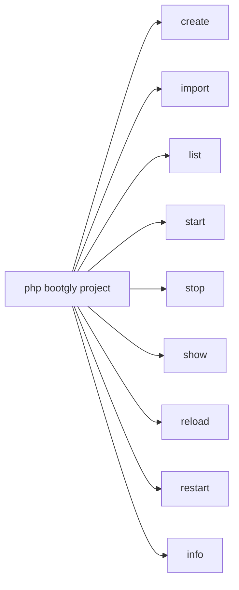
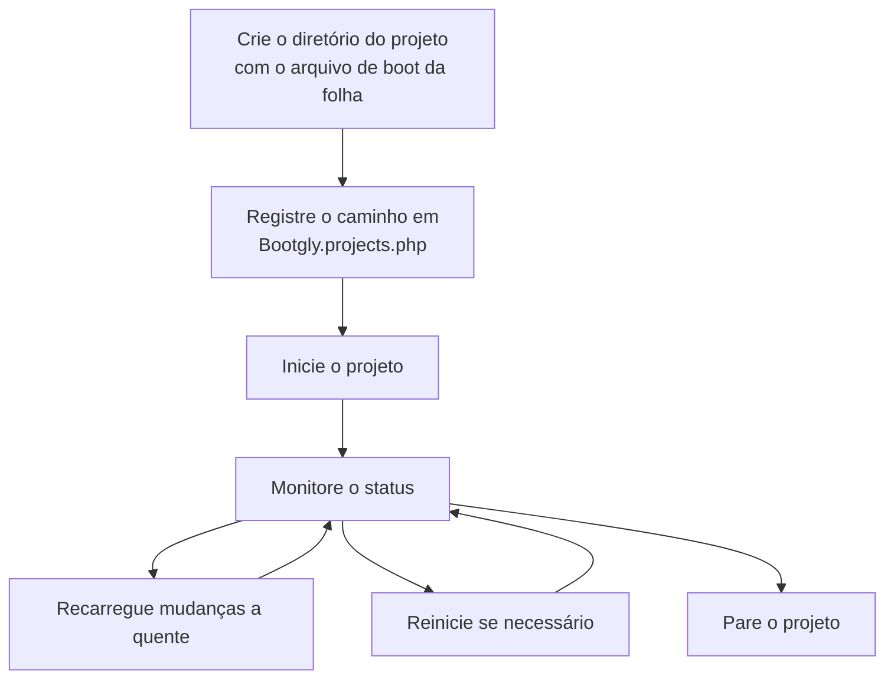

# Projetos

O Bootgly organiza aplicações como **projetos** — diretórios autocontidos dentro de `projects/` que contêm um arquivo de boot. Cada projeto declara seus metadados (nome, descrição, versão, autor) e uma Closure de boot que inicializa a aplicação.

Um projeto pode ficar em **qualquer profundidade** dentro de `projects/`. Um diretório como `Demo/` pode agrupar vários **subprojetos** (`Demo/HTTP_Server_CLI`, `Demo/TCP_Server_CLI`, …), cada um iniciado de forma independente pelo seu caminho. Os projetos são gerenciados inteiramente pelo comando CLI `project`, que lista, executa, para, inspeciona e recarrega a quente.

## Estrutura do projeto

Um projeto é um diretório dentro de `projects/` (em qualquer profundidade) contendo um arquivo de boot nomeado pela **folha** (leaf) da pasta — a convenção é `{folha}.project.php`. O nome do arquivo corresponde ao último segmento do caminho, não ao caminho completo.

```
projects/
├── Bootgly.projects.php          ← o registro (allow-list)
├── Site/                         ← um projeto plano (um segmento de caminho)
│   └── Site.project.php
└── Demo/                         ← uma pasta de agrupamento (não é um projeto)
    ├── HTTP_Server_CLI/
    │   └── HTTP_Server_CLI.project.php
    └── TCP_Server_CLI/
        └── TCP_Server_CLI.project.php
```

Aqui `Demo/HTTP_Server_CLI` e `Demo/TCP_Server_CLI` são dois subprojetos agrupados sob `Demo/`. O próprio `Demo/` não tem `.project.php` — é apenas um contêiner.

### Exemplo de arquivo de boot

Cada arquivo de boot retorna uma instância `Project` com metadados e uma Closure de boot:

```php
use Bootgly\API\Projects\Project;

return new Project(
   name: 'Generic Project',
   description: 'A generic Bootgly project example',
   version: '1.0.0',
   author: 'Your Name',
   exportable: true,

   boot: function (array $arguments = [], array $options = []): void
   {
      // Inicialize e execute sua aplicação aqui
   }
);
```

O construtor deriva `path` (o diretório absoluto do projeto) e `folder` (o caminho do projeto **relativo a** `projects/`, ex.: `Demo/HTTP_Server_CLI`) automaticamente a partir da localização do arquivo de boot — `folder` é o identificador canônico do projeto.

## O registro de projetos

Um único arquivo na raiz de `projects/` — **`Bootgly.projects.php`** — declara todos os projetos registrados. Ele é ao mesmo tempo o mapa de interfaces (quais projetos pertencem a CLI e/ou WPI) **e a fronteira de segurança**: apenas os caminhos listados aqui podem ser iniciados ou autobootados.

Ele retorna um mapa indexado por projeto, mantido em **ordem alfabética por caminho**. Cada chave é o caminho canônico de um projeto (relativo a `projects/`); cada valor lista as `interfaces` que ele serve:

```php
<?php
return [
   'Demo/CLI'             => ['interfaces' => ['CLI']],
   'Demo/HTTP_Server_CLI' => ['interfaces' => ['WPI'], 'default' => true],
   'Demo/TCP_Server_CLI'  => ['interfaces' => ['WPI']],
   'Site'                 => ['interfaces' => ['CLI']],
];
```

Um projeto que serve ambas as interfaces lista as duas: `['interfaces' => ['CLI', 'WPI']]`. Na plataforma Web, a entrada WPI marcada com `'default' => true` é bootada por padrão — a ordem alfabética do arquivo não afeta essa escolha. Se nenhuma entrada estiver marcada, o primeiro projeto WPI registrado é usado.

### Por que uma allow-list

Como os projetos podem aninhar arbitrariamente, um atacante que comprometesse a sua árvore de projetos poderia esconder um `.project.php` aninhado malicioso e fazê-lo executar. O registro fecha essa porta: `bootgly project <caminho> start` executa **apenas** caminhos que sejam chaves exatas de `Bootgly.projects.php`. Qualquer outra coisa — um caminho não registrado, uma pasta de agrupamento (`Demo`), path traversal (`..`), um caminho absoluto, uma barra invertida ou um null byte — é rejeitada, e o diretório resolvido é ainda enjaulado sob a base `projects/`.

Para tornar um novo projeto executável, use `bootgly project create` — ele gera o diretório, o arquivo de boot e a entrada do registro em um único passo. O arquivo de registro é gerenciado por máquina pelo `create`/`import` (as entradas são re-emitidas ordenadas; comentários adicionados à mão dentro do array não são preservados).

## Criando um projeto

`bootgly project create` é a maneira canônica de iniciar um novo projeto. Em terminais interativos, ele abre um **wizard**:

```bash :toolbar="true";
php bootgly project create
```

O wizard prepara o kit na primeira execução (uma multi-seleção dos submodules de plataforma extras — `Console` e/ou `Web` — mais os recursos via `bootgly boot`), depois pergunta o modo de criação:

- **Do zero (from scratch)** — um projeto `CLI` ou `WPI` mínimo gerado a partir dos stubs do framework: ele pergunta o caminho do projeto, interface, porta e metadados, mostra um resumo e confirma;
- **Importando projetos de plataforma** — uma multi-seleção sobre os projetos **exportáveis** encontrados nas pastas de plataforma (como os Demos): cada projeto selecionado é copiado recursivamente sob o próprio caminho no `projects/` do seu workspace, sem perguntas. Cópias existentes a nível de usuário — que se sobrepõem às da plataforma no carregamento — são sinalizadas com `(overwrite)` no resumo e atualizadas;
- **Importando de um remoto Git** — ele pergunta a URL do repositório, o caminho de destino e a interface, e então delega ao `bootgly project import`: o repositório é clonado, validado contra a assinatura `*.project.php` e registrado.

Apenas projetos declarados com `exportable: true` na assinatura `new Project(...)` aparecem no picker de importação.

Não-interativamente (CI, scripts, agentes de IA), tudo vem das flags:

```bash
php bootgly project create App/API --from=scratch --interfaces=WPI --port=8080 --yes
php bootgly project create --from=Demo/HTTP_Server_CLI --yes
```

## Importando um projeto

Qualquer diretório que carregue a **assinatura de projeto Bootgly** — um arquivo `*.project.php` na raiz — é um projeto importável. O `bootgly project import` busca um a partir de uma URL de repositório git:

```bash :toolbar="true";
php bootgly project import https://github.com/foo/project1 Project1
```

O repositório é clonado (git do sistema), validado contra a assinatura, copiado para `projects/Project1/` (o arquivo de assinatura é renomeado para o novo leaf) e registrado na allow-list.

> [!WARNING]
> Projetos importados executam código de terceiros ao serem iniciados — o comando pede confirmação (pule com `--yes`).

## O comando `project`

O comando `project` é a ferramenta central para gerenciar projetos Bootgly. Rode `php bootgly project` para ver todos os subcomandos:



### `project create`

Cria um novo projeto — wizard em terminais interativos, flags caso contrário:

```bash
php bootgly project create [<Name>] [--platform=console,web] [--from=scratch|<source>] \
   [--interfaces=CLI|WPI] [--port=] [--description=] [--version=] [--author=] [--default] [--yes]
```

- `--platform` — plataformas extras a configurar na primeira execução do kit, separadas por vírgula (inicializa os submodules `Console`/`Web` e roda o `bootgly boot`);
- `--from` — `scratch` (padrão) ou o caminho de um projeto de plataforma (ex.: `Demo/HTTP_Server_CLI`). Importações de plataforma mantêm o próprio caminho (`<Name>` é opcional) e atualizam uma cópia existente;
- `--interfaces` — interface vinculada a um projeto do zero (`CLI` por padrão);
- `--default` — marca a entrada como padrão de autoboot Web (WPI);
- `--yes` — pula confirmações.

### `project import`

Importa um projeto de uma URL de repositório git que carregue a assinatura `*.project.php`:

```bash
php bootgly project import <url> [<Name>] [--interfaces=CLI|WPI] [--default] [--yes]
```

### `project list`

Lista todos os projetos registrados, agrupados por interface (CLI, WPI ou ambas):

```bash :toolbar="true";
php bootgly project list
```

Exemplo de saída:

```
 Project list:

 #1  - Benchmark
    Description: Benchmarking project for Bootgly's
    Type: CLI

 #2  - Demo/HTTP_Server_CLI
    Description: Demonstration project for Bootgly HTTP Server CLI
    Type: WPI
```

### `project start`

Boota um projeto pelo seu caminho:

```bash
# Executa um subprojeto pelo caminho
php bootgly project Demo/HTTP_Server_CLI start

# Executa em modo interativo
php bootgly project Demo/HTTP_Server_CLI start -i

# Executa em modo monitor
php bootgly project Demo/HTTP_Server_CLI start -m
```

Você pode inverter a ordem dos argumentos (subcomando primeiro):

```bash
php bootgly project start Demo/HTTP_Server_CLI
php bootgly project stop Demo/HTTP_Server_CLI
```

Opções disponíveis:

| Opção | Descrição |
|-------|-----------|
| `-d` | Executa em modo daemon (padrão) |
| `-i` | Executa em modo interativo |
| `-m` | Executa em modo monitor |

#### Múltiplas instâncias

Um projeto servidor pode rodar **múltiplas instâncias ao mesmo tempo** — uma por porta. A porta bound é o qualificador de instância, então inicie instâncias extras sobrescrevendo a variável de ambiente `PORT`:

```bash
php bootgly project start Blog             # instância na porta padrão do projeto (8080)
PORT=8081 php bootgly project start Blog   # segunda instância na 8081
```

Iniciar uma segunda instância em uma porta já em uso pelo mesmo setup falha com um erro limpo — o servidor obtém um lock não-bloqueante nos arquivos de estado qualificados por porta antes de subir os workers.

### `project stop`

Para um projeto em execução enviando SIGTERM ao processo master. Se o processo não terminar em 5 segundos, envia SIGKILL:

```bash :toolbar="true";
php bootgly project Demo/HTTP_Server_CLI stop
```

Isso para **todas as instâncias em execução** do projeto. Para parar uma única instância, passe o qualificador dela — a porta bound para servidores (ou o PID do master para projetos TUI):

```bash :toolbar="true";
php bootgly project stop Blog 8081   # para apenas a instância na porta 8081
```

### `project show`

Mostra o status atual de um projeto em execução — um card de status por instância — incluindo PID, workers, endereço e uptime:

```bash :toolbar="true";
php bootgly project Demo/HTTP_Server_CLI show
```

Exemplo de saída:

```
┌─ Project Status ────────────────────┐
│ Project        Demo/HTTP_Server_CLI │
│ Type           WPI                  │
│ Status         running              │
│ Master PID     12345                │
│ Workers        11/11                │
│ Address        0.0.0.0:8082         │
│ Uptime         2h 15m 30s           │
└─────────────────────────────────────┘
```

### Estado de processo (arquivos PID)

Quando um projeto inicia, ele salva o estado do processo (PID do master, PIDs dos workers, tipo, etc.) em um arquivo JSON sob `storage/pids/`. O arquivo é nomeado pelo caminho canônico do projeto, com `/` codificado como `~` para que folhas aninhadas nunca colidam, mais um **qualificador de instância**: a porta bound para servidores, o PID do processo para projetos TUI e clients WPI. Executar `Demo/HTTP_Server_CLI` na porta 8082 cria `storage/pids/Demo~HTTP_Server_CLI.8082.json`.

Como clients qualificam por PID, qualquer número de processos client do mesmo projeto pode rodar ao mesmo tempo — incluindo geradores de carga com fork, onde cada filho forkado constrói sua própria instância de client.

Os comandos `project stop`, `project show`, `project reload` e `project restart` descobrem automaticamente todas as instâncias de um dado caminho de projeto (arquivos legados sem qualificador, `<project>.json`, ainda são reconhecidos).

### `project reload`

Envia um sinal de hot-reload (SIGUSR2) a todas as instâncias em execução de um projeto, permitindo recarregar o código sem um restart completo — ou a uma única instância quando uma porta é passada:

```bash
php bootgly project Demo/HTTP_Server_CLI reload
php bootgly project reload Blog 8081   # recarrega apenas a instância na porta 8081
```

### `project restart`

Para e então inicia o projeto novamente, preservando a porta da instância. Com uma única instância em execução a porta é derivada automaticamente; com múltiplas instâncias, passe a porta da que deve reiniciar:

```bash
php bootgly project Demo/HTTP_Server_CLI restart
php bootgly project restart Blog 8081   # reinicia apenas a instância na porta 8081
```

### `project info`

Exibe metadados detalhados de um projeto em um Fieldset:

```bash :toolbar="true";
php bootgly project Demo/HTTP_Server_CLI info
```

Exemplo de saída:

```
┌─ Project Info ──────────────────────────────────────────────────────┐
│ Name           Demo HTTP Server CLI                                │
│ Folder         Demo/HTTP_Server_CLI                                │
│ Description    Demonstration project for Bootgly HTTP Server CLI   │
│ Version        1.0.0                                               │
│ Author         Bootgly                                             │
│ Interfaces     WPI                                                 │
│ Path           /path/to/projects/Demo/HTTP_Server_CLI             │
└─────────────────────────────────────────────────────────────────────┘
```

## Ciclo de vida do projeto

O ciclo de vida típico de um projeto segue este fluxo:



1. **Crie** um diretório em `projects/` (em qualquer profundidade) com um arquivo de boot `{folha}.project.php`;
2. **Registre** o caminho dele em `Bootgly.projects.php` sob a(s) interface(s) certa(s);
3. **Execute** com `project start`;
4. **Monitore** o status com `project show`;
5. **Recarregue** mudanças de código com `project reload` (envia SIGUSR2);
6. **Reinicie** completamente se necessário com `project restart`;
7. **Pare** com `project stop`.

## Projetos integrados

O Bootgly traz projetos de exemplo sob `projects/`:

| Projeto | Interface | Descrição |
|---------|-----------|-----------|
| `Demo/CLI` | CLI | Demo CLI interativo dos componentes de terminal |
| `Demo/HTTP_Server_CLI` | WPI | Demo de servidor HTTP com rotas, ORM e observabilidade |
| `Demo/HTTPS_Server_CLI` | WPI | Demo de servidor HTTPS |
| `Demo/TCP_Server_CLI` | WPI | Servidor TCP cru com workers configuráveis |
| `Demo/Queue-HTTP_Server_CLI` | WPI | Servidor HTTP que enfileira jobs em background |
| `Benchmark/HTTP_Server_CLI` | WPI | Benchmark de servidor HTTP (routers simple/techempower/bootgly) |
| `Benchmark/TCP_Server_CLI` | WPI | Benchmark de servidor TCP cru (HTTP ou echo) |
| `Benchmark/UDP_Server_CLI` | WPI | Benchmark de servidor UDP echo |
```
