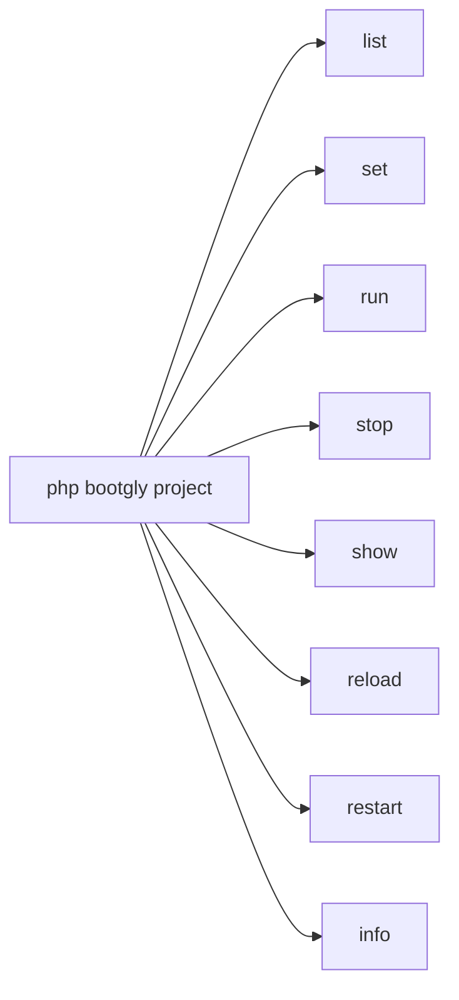
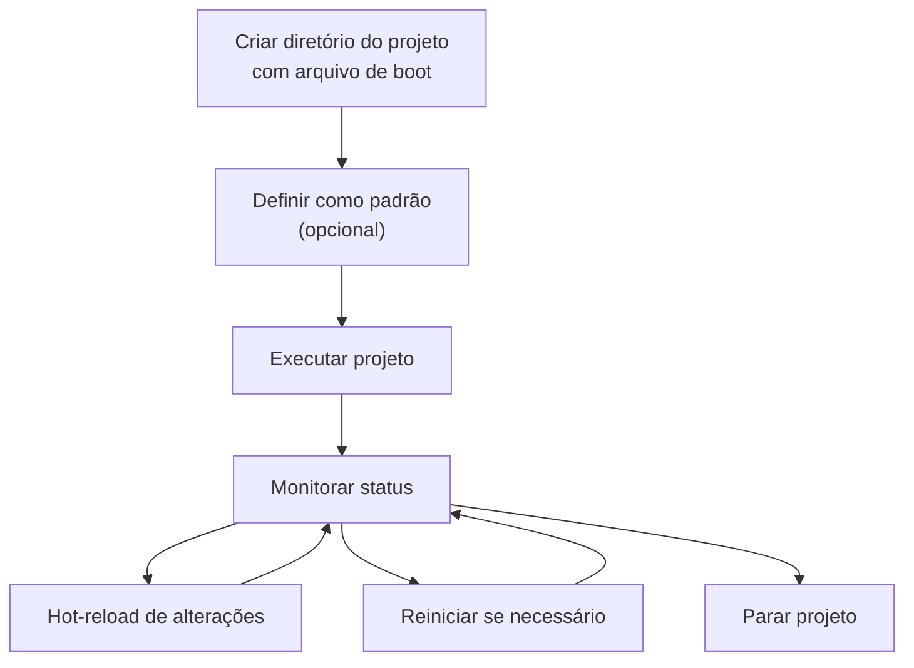

# Projetos

O Bootgly organiza aplicações como **projetos** — diretórios autocontidos dentro de `projects/` que contêm um ou mais arquivos de boot. Cada projeto declara seus metadados (name, description, version, author) e uma Closure de boot que inicializa a aplicação.

Os projetos são gerenciados inteiramente através do comando CLI `project`, que fornece subcomandos para listar, executar, parar, inspecionar e fazer hot-reload de projetos.

## Estrutura de um projeto

Um projeto é um diretório dentro de `projects/` com um arquivo de boot. O arquivo de boot segue a convenção de nomenclatura `{project_folder_name}.project.php` — o nome do arquivo deve corresponder ao nome da pasta do projeto.

Por exemplo, um projeto na pasta `Sample_Project` deve ter seu arquivo de boot nomeado como `Sample_Project.project.php`:

```
projects/
├── Sample_Project/
│   └── Sample_Project.project.php
├── Another_Project/
│   └── Another_Project.project.php
└── @.php
```

### Exemplo de arquivo de boot

Cada arquivo de boot retorna uma instância de `Project` com metadados e uma Closure de boot:

```php
use Bootgly\API\Projects\Project;

return new Project(
   name: 'Projeto Genérico',
   description: 'Um exemplo genérico de projeto Bootgly',
   version: '1.0.0',
   author: 'Seu Nome',

   boot: function (array $arguments = [], array $options = []): void
   {
      // Inicialize e execute sua aplicação aqui
   }
);
```

A classe `Project` aceita as seguintes propriedades:

| Propriedade | Tipo | Descrição |
|-------------|------|-----------|
| `name` | string | Nome de exibição do projeto |
| `description` | string | Breve descrição |
| `version` | string | Versão semântica |
| `author` | string | Nome do autor |
| `boot` | Closure | A função de boot que inicializa a aplicação |

### Projeto padrão

O arquivo `projects/@.php` define qual projeto é o padrão:

```php
<?php
return [
   'default' => 'Sample_Project'
];
```

## O comando `project`

O comando `project` é a ferramenta central para gerenciar projetos Bootgly. Execute `php bootgly project` para ver todos os subcomandos disponíveis:



### `project list`

Descobre e lista todos os projetos no diretório `projects/`, mostrando suas interfaces (CLI, WPI ou ambas) e marcando o projeto padrão:

```bash
php bootgly project list
```

Exemplo de saída:

```
 Project list:

 #1  - Projeto Generico (projects/Sample_Project) [CLI] [default]
    Exemplo generico de projeto para a documentacao do Bootgly
 #2  - Outro Projeto (projects/Another_Project) [WPI]
```

### `project set`

Define propriedades do projeto. Atualmente suporta definir o projeto padrão:

```bash
php bootgly project set Sample_Project --default
```

Isso atualiza o `projects/@.php` para que `project run` (sem argumentos) inicialize o projeto especificado.

### `project run`

Inicializa um projeto pelo nome ou o projeto padrão:

```bash
# Executar um projeto específico
php bootgly project run Sample_Project

# Executar outro projeto
php bootgly project run Another_Project

# Executar em modo interativo
php bootgly project run Sample_Project -i

# Executar em modo monitor
php bootgly project run Sample_Project -m
```

Opções disponíveis:

| Opção | Descrição |
|-------|-----------|
| `-d` | Executar em modo daemon (padrão) |
| `-i` | Executar em modo interativo |
| `-m` | Executar em modo monitor |

### `project stop`

Para um projeto em execução enviando SIGTERM ao processo master. Se o processo não terminar em 5 segundos, envia SIGKILL:

```bash
# Parar um projeto específico
php bootgly project stop Sample_Project
```

### `project show`

Mostra o status atual de um projeto em execução, incluindo PID, workers, endereço e uptime:

```bash
php bootgly project show Sample_Project
```

Exemplo de saída:

```
┌─ Project Status ────────────────────┐
│ Project        Sample_Project       │
│ Type           CLI                  │
│ Status         running              │
│ Master PID     12345                │
│ Workers        11/11                │
│ Address        -                    │
│ Uptime         2h 15m 30s           │
└─────────────────────────────────────┘
```

### `project reload`

Envia um sinal de hot-reload (SIGUSR2) a um projeto em execução, permitindo que ele recarregue seu código sem um restart completo:

```bash
php bootgly project reload Sample_Project
```

### `project restart`

Para e depois inicia o projeto novamente. Aceita as mesmas opções que `project run`:

```bash
php bootgly project restart Sample_Project
```

### `project info`

Exibe metadados detalhados sobre um projeto em um Fieldset:

```bash
php bootgly project info Sample_Project
```

Exemplo de saída:

```
┌─ Project Info ──────────────────────────────────────────────────────┐
│ Name           Projeto Generico                                    │
│ Folder         Sample_Project                                      │
│ Description    Um exemplo generico de projeto Bootgly              │
│ Version        0.1.0                                               │
│ Author         Seu Nome                                            │
│ Interfaces     CLI                                                 │
│ Path           /path/to/projects/Sample_Project                    │
└─────────────────────────────────────────────────────────────────────┘
```

## Ciclo de vida de um projeto

O ciclo de vida típico de um projeto segue este fluxo:



1. **Criar** um diretório em `projects/` com um arquivo de boot `*.project.php`;
2. **Definir** como padrão (opcional) com `project set <name> --default`;
3. **Executar** com `project run`;
4. **Monitorar** seu status com `project show`;
5. **Recarregar** alterações de código com `project reload` (envia SIGUSR2);
6. **Reiniciar** completamente se necessário com `project restart`;
7. **Parar** com `project stop`.

## Projetos built-in

O Bootgly vem com vários projetos de exemplo no diretório `projects/`:

| Projeto | Interface | Descrição |
|---------|-----------|-----------|
| `Demo_CLI` | CLI | Demo interativo de CLI para componentes de terminal (22 demos) |
| `HTTP_Server_CLI` | WPI | Demo de HTTP server com roteamento estático/dinâmico e catch-all 404 |
| `TCP_Server_CLI` | WPI | TCP server raw com workers configuráveis |
| `TCP_Client_CLI` | CLI | Benchmark de TCP client (teste de stress write/read) |