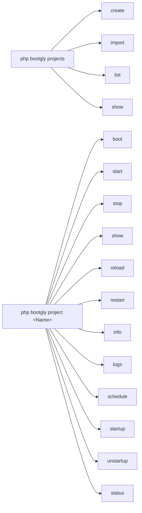
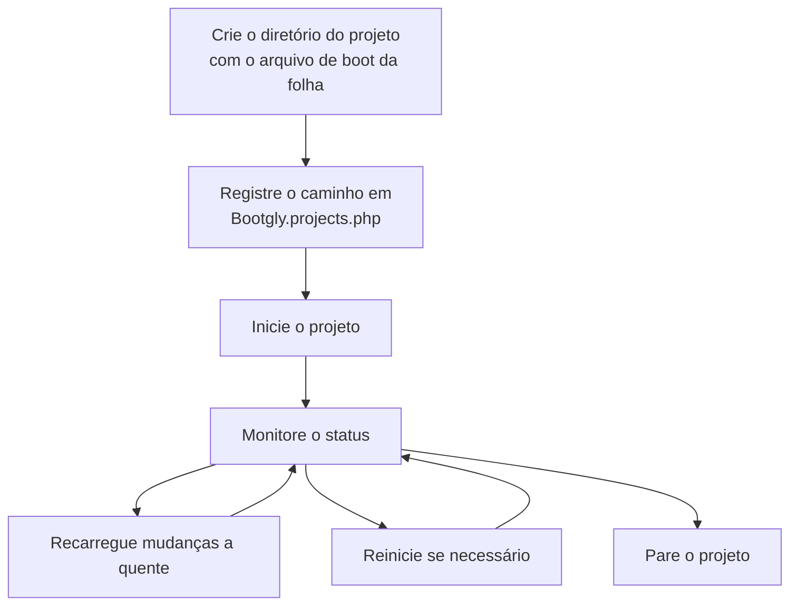

# Projetos

O Bootgly organiza aplicações como **projetos** — diretórios autocontidos dentro de `projects/` que contêm um arquivo de boot. Cada projeto declara seus metadados (nome, descrição, versão, autor) e uma Closure de boot que inicializa a aplicação.

Um projeto pode ficar em **qualquer profundidade** dentro de `projects/`. Um diretório como `Demo/` pode agrupar vários **subprojetos** (`Demo/HTTP_Server_CLI`, `Demo/TCP_Server_CLI`, …), cada um iniciado de forma independente pelo seu caminho. Os projetos são gerenciados inteiramente pelo comando CLI `project`, que lista, executa, para, inspeciona e recarrega a quente.

## Estrutura do projeto

Um projeto é um diretório dentro de `projects/` (em qualquer profundidade) contendo um arquivo de boot nomeado pela **folha** (leaf) da pasta — a convenção é `{folha}.Project.php`. O nome do arquivo corresponde ao último segmento do caminho, não ao caminho completo.

```
projects/
├── Bootgly.projects.php          ← o registro (allow-list)
├── Site/                         ← um projeto plano (um segmento de caminho)
│   └── Site.Project.php
└── Demo/                         ← uma pasta de agrupamento (não é um projeto)
    ├── HTTP_Server_CLI/
    │   └── HTTP_Server_CLI.Project.php
    └── TCP_Server_CLI/
        └── TCP_Server_CLI.Project.php
```

Aqui `Demo/HTTP_Server_CLI` e `Demo/TCP_Server_CLI` são dois subprojetos agrupados sob `Demo/`. O próprio `Demo/` não tem `.Project.php` — é apenas um contêiner.

### Exemplo de arquivo de boot

Cada arquivo de boot retorna uma instância `Project` com metadados e uma Closure de boot:

```php
use Bootgly\API\Projects\Project;

return new Project(
   name: 'Generic Project',
   description: 'A generic Bootgly project example',
   version: '1.0.0',
   author: 'Your Name',
   exportable: true,

   boot: function (array $arguments = [], array $options = []): void
   {
      // Inicialize e execute sua aplicação aqui
   }
);
```

O construtor deriva `path` (o diretório absoluto do projeto) e `folder` (o caminho do projeto **relativo a** `projects/`, ex.: `Demo/HTTP_Server_CLI`) automaticamente a partir da localização do arquivo de boot — `folder` é o identificador canônico do projeto.

## O registro de projetos

Um único arquivo na raiz de `projects/` — **`Bootgly.projects.php`** — declara todos os projetos registrados. Ele é ao mesmo tempo o mapa de interfaces (quais projetos pertencem a CLI e/ou WPI) **e a fronteira de segurança**: apenas os caminhos listados aqui podem ser iniciados.

Ele retorna um mapa indexado por projeto, mantido em **ordem alfabética por caminho**. Cada chave é o caminho canônico de um projeto (relativo a `projects/`); cada valor lista as `interfaces` que ele serve:

```php
<?php
return [
   'Demo/CLI'             => ['interfaces' => ['CLI']],
   'Demo/HTTP_Server_CLI' => ['interfaces' => ['WPI']],
   'Demo/TCP_Server_CLI'  => ['interfaces' => ['WPI']],
   'Site'                 => ['interfaces' => ['CLI']],
];
```

Um projeto que serve ambas as interfaces lista as duas: `['interfaces' => ['CLI', 'WPI']]`. Projetos Web são servidos pelo próprio servidor HTTP CLI do Bootgly e sempre iniciados pelo nome (`bootgly project <path> start`) — não existe modo SAPI web nem default de autoboot.

### Por que uma allow-list

Como os projetos podem aninhar arbitrariamente, um atacante que comprometesse a sua árvore de projetos poderia esconder um `.Project.php` aninhado malicioso e fazê-lo executar. O registro fecha essa porta: `bootgly project <caminho> start` executa **apenas** caminhos que sejam chaves exatas de `Bootgly.projects.php`. Qualquer outra coisa — um caminho não registrado, uma pasta de agrupamento (`Demo`), path traversal (`..`), um caminho absoluto, uma barra invertida ou um null byte — é rejeitada, e o diretório resolvido é ainda enjaulado sob a base `projects/`.

Para tornar um novo projeto executável, use `bootgly projects create` — ele gera o diretório, o arquivo de boot e a entrada do registro em um único passo. O arquivo de registro é gerenciado por máquina pelo `create`/`import` (as entradas são re-emitidas ordenadas; comentários adicionados à mão dentro do array não são preservados).

Todo valor é re-emitido como um literal PHP escapado, o arquivo é verificado pelo parser antes de ser instalado e a escrita é atômica — então nenhum nome de projeto ou metadado consegue deixar o registro sem parse. Os caminhos criados por `create`/`import` seguem um alfabeto de nomes: cada segmento começa com maiúscula e usa apenas letras, números, `_` ou `-` (ex.: `App` ou `App/API`). Um caminho registrado à mão antes dessa regra continua funcionando — a fronteira é a verificação no allow-list, não o alfabeto.

## Criando um projeto

`bootgly projects create` é a maneira canônica de iniciar um novo projeto. Em terminais interativos, ele abre um **wizard**:

```bash :toolbar="true";
php bootgly projects create
```

O wizard prepara o kit na primeira execução — todos os submodules de plataforma (`Console` e `Web`), os recursos via `bootgly boot` e os exemplos embarcados, nada disso perguntado —, depois pergunta o modo de criação:

- **Usar o que já foi importado** — o primeiro modo não cria nada. Um kit preparado já carrega todos os projetos exportáveis das plataformas, então ficar como está e abrir um deles é uma forma legítima de começar; a opção informa quantos o kit tem;
- **Do zero (from scratch)** — um projeto `CLI` ou `WPI` mínimo gerado a partir dos stubs do framework: ele pergunta o caminho do projeto, interface, porta e metadados, mostra um resumo e confirma;
- **Importando de um remoto Git** — ele pergunta a URL do repositório, o caminho de destino e a interface, e então delega ao `bootgly projects import`: o repositório é clonado, validado contra a assinatura `*.Project.php` e registrado.

Apenas projetos declarados com `exportable: true` na assinatura `new Project(...)` são estocados como exemplos ou copiados por `--from=<origem>`.

Não-interativamente (CI, scripts, agentes de IA), tudo vem das flags:

```bash
php bootgly projects create App/API --from=scratch --interfaces=WPI --port=8080 --yes
php bootgly projects create --from=Demo/HTTP_Server_CLI --yes
```

**Todo projeto que você cria é bootado — um repositório git próprio.** O
`create` roda o hook `bootgly project <Name> boot`: o scaffold — a assinatura
do projeto, um registro `tests/` com uma suíte de exemplo e um `.gitignore`
(ignorando `/vendor/`) — chega como um commit inicial, então `git log`,
branches e um remote da sua escolha funcionam desde o primeiro minuto.
`--no-git` pula o hook; numa máquina sem identidade git configurada, o
repositório fica inicializado com o scaffold em stage e nada é commitado em
seu nome. Um projeto aninhado (ex.: `App/API` dentro de `App`) entra no
repositório do pai em vez de aninhar outro.

Os **exemplos de plataforma embarcados** — os Demos, os jogos do Console e os
apps Web — são importados automaticamente quando o kit é preparado (primeiro
boot, e sempre que uma plataforma é inicializada), então um kit recém-criado
sempre carrega guias vivos para pessoas e agentes de IA. Eles chegam **sem
boot** — são guias, não trabalho seu; adote um com
`php bootgly project <Name> boot`. Um exemplo que você apagar continua
apagado. O kit em si nunca rastreia `projects/` — cada projeto é a unidade de
versionamento, e o **Composer também é por projeto**: rode `composer require`
dentro de `projects/<Name>/`, e o framework carrega o `vendor/autoload.php`
daquele projeto quando ele sobe.

## Importando um projeto

Qualquer diretório que carregue a **assinatura de projeto Bootgly** — um arquivo `*.Project.php` na raiz — é um projeto importável. O `bootgly projects import` busca um a partir de uma URL de repositório git:

```bash :toolbar="true";
php bootgly projects import https://github.com/foo/project1 Project1
```

O repositório é clonado (git do sistema) com o **histórico completo**, validado contra a assinatura, colocado em `projects/Project1/` — `.git`, remote `origin` e tudo, então você continua commitando e dando push de lá — e registrado na allow-list. Quando o nome de destino difere do da origem, o arquivo de assinatura é renomeado para o novo leaf e deixado **sem commit** para você revisar. Toda regra que o registro impõe é verificada antes da cópia, então uma importação recusada não deixa nada para trás.

> [!WARNING]
> Projetos importados executam código de terceiros ao serem iniciados — o comando pede confirmação (pule com `--yes`).

## Os comandos `projects` e `project`

Dois comandos dividem o trabalho pelo que endereçam. `projects` é o kit como um todo — o registro (`create`, `import`, `list`) e o que está rodando nele (`show`); `project <Name>` é um projeto que você nomeia. Rode `php bootgly projects` ou `php bootgly project` para ver os subcomandos de cada um:


```mermaid
graph LR
  projects["php bootgly projects"]
  projects --> create["create"]
  projects --> import["import"]
  projects --> list["list"]
  projects --> ps["show"]
  project["php bootgly project &lt;Name&gt;"]
  project --> boot["boot"]
  project --> start["start"]
  project --> stop["stop"]
  project --> show["show"]
  project --> reload["reload"]
  project --> restart["restart"]
  project --> info["info"]
  project --> logs["logs"]
  project --> schedule["schedule"]
  project --> startup["startup"]
  project --> unstartup["unstartup"]
  project --> status["status"]
```

### `projects create`

Cria um novo projeto — wizard em terminais interativos, flags caso contrário:

```bash
php bootgly projects create [<Name>] [--platform=console,web] [--from=scratch|<source>] \
   [--interfaces=CLI|WPI] [--port=] [--description=] [--version=] [--author=] [--yes]
```

- `--platform` — restringe o que a primeira execução do kit configura, separado por vírgula. Todas as plataformas são configuradas por padrão (submodules `Console` e `Web` inicializados, `bootgly boot` executado, exemplos embarcados importados), então essa flag só importa quando você quer menos: `--platform=console` para uma delas, `--platform=none` para ficar só com a plataforma base. Uma execução posterior configura apenas o que ela nomear — uma plataforma que você removeu continua removida;
- `--from` — `scratch` (padrão) ou o caminho de um projeto de plataforma (ex.: `Demo/HTTP_Server_CLI`). Importações de plataforma mantêm o próprio caminho (`<Name>` é opcional) e atualizam uma cópia existente — a cópia nova é construída ao lado da antiga e trocada só depois de completa. Só uma cópia de projeto (um diretório com `*.Project.php` na raiz) é atualizada; um grupo de projetos ou um diretório feito à mão nesse caminho é recusado, nunca substituído;
- `--interfaces` — interface vinculada a um projeto do zero (`CLI` por padrão);
- `--port` — porta HTTP escrita no arquivo de um projeto WPI do zero (`8080` por padrão); um número entre 1 e 65535, recusada caso contrário;
- `--description`, `--version`, `--author` — metadados escritos no arquivo do projeto; aspas e barras invertidas são armazenadas com segurança, caracteres de controle são recusados;
- `--yes` — pula confirmações;
- `--no-git` — pula o hook de boot (o repositório git próprio do projeto, criado e commitado por padrão nos creates from-scratch);
- `--refresh` — com `--from=<origem>`, substitui um destino que já é um repositório git. Sem ela o comando recusa: um repositório em `projects/` é a sua única cópia daquele histórico.

O nome que você passa para o `create` é seu: um exemplo embarcado que tomaria o mesmo caminho não é estocado, então o primeiro comando num kit novo nunca perde para um nome que você nunca viu.

### `project boot`

Boota um projeto — inicializa os recursos que um projeto seu carrega. Hoje isso é o controle de versão (um repositório git próprio, com a árvore atual como commit inicial); mais responsabilidades chegarão aqui conforme o ciclo de vida do projeto crescer:

```bash
php bootgly project <Name> boot
```

O `projects create` roda o mesmo hook para todo projeto from-scratch. Os exemplos de plataforma embarcados chegam sem boot; este subcomando é como você adota um. Uma importação por URL já traz repositório e histórico próprios. Best-effort por design: shell desabilitado, git ausente ou identidade não configurada degradam para uma nota, nunca para uma falha.

### `projects import`

Importa um projeto de uma URL de repositório git que carregue a assinatura `*.Project.php`. Sem argumentos, terminais interativos escolhem antes a fonte da importação — as Plataformas (uma multi-seleção mostrando quantos projetos exportáveis estão disponíveis) ou um remoto Git (pergunta a URL):

```bash
php bootgly projects import <url> [<Name>] [--interfaces=CLI|WPI] [--yes]
```

### `projects list`

Lista todos os projetos registrados — uma linha para cada, com as interfaces que o registro vincula a ele e a descrição que a assinatura carrega. A descrição é cortada na largura do terminal, nunca quebrada em linhas:

```bash :toolbar="true";
php bootgly projects list
```

Exemplo de saída:

```
╔═════╤══════════════════════╤════════════╤═══════════════════════════════════════════════════════╗
║ #   │ Project              │ Interface  │ Description                                           ║
╟─────┼──────────────────────┼────────────┼───────────────────────────────────────────────────────╢
║ 1   │ App/API              │ WPI        │ Orders API                                            ║
║ 2   │ Demo/CLI             │ CLI        │ Demonstration project for Bootgly CLI features        ║
║ 3   │ Demo/HTTP_Server_CLI │ WPI        │ Demonstration project for Bootgly HTTP Server CLI     ║
╚═════╧══════════════════════╧════════════╧═══════════════════════════════════════════════════════╝
```

### `projects show`

Mostra toda **instância em execução** entre os projetos registrados — o `ps` do kit. Uma linha por instância, nunca por projeto: um projeto pode ter várias (uma por porta vinculada nos servidores, uma por PID do master nos workers de console e de schedule), e a instância é o que você endereça por porta em `stop`/`reload` ou com `--instance` em `logs`:

```bash :toolbar="true";
php bootgly projects show
```

Exemplo de saída:

```
╔══════════════════════╤══════════╤═══════════╤═════════╤════════╤═════════╤════════╤══════════════╤═════╗
║ Project              │ Instance │ Interface │ Status  │ Master │ Workers │ Uptime │ Address      │ Tap ║
╟──────────────────────┼──────────┼───────────┼─────────┼────────┼─────────┼────────┼──────────────┼─────╢
║ Demo/HTTP_Server_CLI │ 8080     │ WPI       │ running │ 41230  │ 4       │ 2h 15m │ 0.0.0.0:8080 │ yes ║
║ App/API              │ 8443     │ WPI       │ paused  │ 41301  │ 4       │ 2h 14m │ 0.0.0.0:8443 │ yes ║
║ App/API              │ 41988    │ CLI       │ running │ 41988  │ -       │ 5m 12s │ -            │ -   ║
╚══════════════════════╧══════════╧═══════════╧═════════╧════════╧═════════╧════════╧══════════════╧═════╝
```

A vivacidade vem do lock da instância — a mesma prova que `project <Name> show` usa —, então um arquivo de estado deixado por um crash nunca aparece como running. `Tap` diz se a instância publica o socket de log ao vivo ao qual o `logs -f` se conecta. Num terminal estreito a tabela abre mão das colunas secundárias primeiro — `Tap`, `Workers`, `Master`, `Interface`, depois `Address` e `Uptime` —, como o `pm2 ps` faz; `Project`, `Instance` e `Status` ficam sempre, e o `--json` carrega todos os campos sempre. Duas flags:

- `--all` — lista também o que ainda está registrado mas não roda mais (`stopped`): o tombstone que um stop limpo deixa, ou um documento cujo master se foi;
- `--json` — um documento JSON com as mesmas linhas (`project`, `instance`, `interface`, `status`, `master`, `workers`, `uptime` em segundos, `address`, `tap`), para scripts e agentes.

Sem nada rodando, imprime `No running instance found.` — e, quando existem arquivos de estado que este usuário não consegue verificar, uma dica nomeando a conta de serviço que os iniciou.

### `project start`

Boota um projeto pelo seu caminho:

```bash
# Executa um subprojeto pelo caminho
php bootgly project Demo/HTTP_Server_CLI start

# Executa em modo interativo
php bootgly project Demo/HTTP_Server_CLI start -i

# Executa em modo monitor
php bootgly project Demo/HTTP_Server_CLI start -m
```

Você pode inverter a ordem dos argumentos (subcomando primeiro):

```bash
php bootgly project start Demo/HTTP_Server_CLI
php bootgly project stop Demo/HTTP_Server_CLI
```

Opções disponíveis:

| Opção | Descrição |
|-------|-----------|
| `-d` | Executa em modo daemon (padrão) |
| `-i` | Executa em modo interativo |
| `-m` | Executa em modo monitor |

#### Múltiplas instâncias

Um projeto servidor pode rodar **múltiplas instâncias ao mesmo tempo** — uma por porta. A porta bound é o qualificador de instância, então inicie instâncias extras sobrescrevendo a variável de ambiente `PORT`:

```bash
php bootgly project start Blog             # instância na porta padrão do projeto (8080)
PORT=8081 php bootgly project start Blog   # segunda instância na 8081
```

Iniciar uma segunda instância em uma porta já em uso pelo mesmo setup falha com um erro limpo — o servidor obtém um lock não-bloqueante nos arquivos de estado qualificados por porta antes de subir os workers.

### `project stop`

Para um projeto em execução enviando SIGTERM ao processo master. Se o processo não terminar em 5 segundos, envia SIGKILL:

```bash :toolbar="true";
php bootgly project Demo/HTTP_Server_CLI stop
```

Isso para **todas as instâncias em execução** do projeto. Para parar uma única instância, passe o qualificador dela — a porta bound para servidores (ou o PID do master para projetos TUI):

```bash :toolbar="true";
php bootgly project stop Blog 8081   # para apenas a instância na porta 8081
```

### `project show`

Mostra o status atual de um projeto em execução — um card de status por instância — incluindo PID, workers, endereço e uptime:

```bash :toolbar="true";
php bootgly project Demo/HTTP_Server_CLI show
```

Exemplo de saída:

```
┌─ Project Status ────────────────────┐
│ Project        Demo/HTTP_Server_CLI │
│ Type           WPI                  │
│ Status         running              │
│ Master PID     12345                │
│ Workers        11/11                │
│ Address        0.0.0.0:8082         │
│ Uptime         2h 15m 30s           │
└─────────────────────────────────────┘
```

### `project logs`

Lê o backlog de logs persistido de um projeto e, com `-f`, o segue **ao vivo** — em qualquer modo
de servidor, Daemon incluído. Endereçado pelo nome, nunca pela porta; `--instance` restringe a uma
instância — no backlog pelo campo `instance` dos records, e ao vivo escolhendo qual tap seguir (com
várias vivas e sem `--instance`, o `-f` as lista e recusa). Veja o
**[guia do CLI de Logs](/guide/logs/overview/)** para o fluxo completo e os filtros:

```bash :toolbar="true";
php bootgly project Demo/HTTP_Server_CLI logs -f
php bootgly project Demo/HTTP_Server_CLI logs --since=15m --level=warning --json
```

### `project schedule`

Roda os jobs cron-style de um projeto (o seu `schedule.php`) — o comando **monta** o
ambiente do projeto (configs, catálogos, autoloader, procedência de logs) sem rodar sua
entrada de boot, então o servidor de um projeto WPI nunca sobe. O worker registra uma
instância qualificada por PID, então `show`/`stop`/`logs` o endereçam. Veja o
**[guia do Scheduler](/guide/scheduler/overview/)**:

```bash :toolbar="true";
php bootgly project App schedule run    # loop do worker alinhado ao minuto (SIGTERM para)
php bootgly project App schedule list   # jobs registrados e a próxima execução
```

### Estado de processo (arquivos PID)

Quando um projeto inicia, ele salva o estado do processo (PID do master, PIDs dos workers, tipo, etc.) em um arquivo JSON sob `storage/pids/`. O arquivo é nomeado pelo caminho canônico do projeto, com `/` codificado como `~` para que folhas aninhadas nunca colidam, mais um **qualificador de instância**: a porta bound para servidores, o PID do processo para projetos TUI e clients WPI. Executar `Demo/HTTP_Server_CLI` na porta 8082 cria `storage/pids/Demo~HTTP_Server_CLI.8082.json`. Um **projeto só de Console** iniciado com `project start` também registra uma instância, qualificada pelo PID do master — assim `show`, `stop` e `logs` conseguem endereçá-lo. Instâncias de servidor publicam ainda um irmão `.logs.sock`: o socket do tap de logs ao vivo ao qual o `logs -f` se anexa. Instâncias de servidor e de Console também estampam esse qualificador em todo record que escrevem — o campo `instance` pelo qual o `logs --instance` filtra; records de clients não carregam nenhum.

Como clients qualificam por PID, qualquer número de processos client do mesmo projeto pode rodar ao mesmo tempo — incluindo geradores de carga com fork, onde cada filho forkado constrói sua própria instância de client.

Os comandos `project stop`, `project show`, `project reload` e `project restart` descobrem automaticamente todas as instâncias de um dado caminho de projeto (arquivos legados sem qualificador, `<project>.json`, ainda são reconhecidos).

### `project reload`

Envia um sinal de hot-reload (SIGUSR2) a todas as instâncias em execução de um projeto, permitindo recarregar o código sem um restart completo — ou a uma única instância quando uma porta é passada:

```bash
php bootgly project Demo/HTTP_Server_CLI reload
php bootgly project reload Blog 8081   # recarrega apenas a instância na porta 8081
```

### `project restart`

Para e então inicia o projeto novamente, preservando a porta da instância. Com uma única instância em execução a porta é derivada automaticamente; com múltiplas instâncias, passe a porta da que deve reiniciar:

```bash
php bootgly project Demo/HTTP_Server_CLI restart
php bootgly project restart Blog 8081   # reinicia apenas a instância na porta 8081
```

### `project startup`

Instala o serviço do SO que sobe o projeto no boot — o `pm2 startup` de um projeto. Só systemd, por enquanto: numa máquina iniciada por qualquer outro init (OpenRC, runit, um container cujo PID 1 é a própria aplicação, macOS) o comando nomeia a plataforma, imprime o comando que um serviço escrito à mão precisa rodar e para.

```bash
php bootgly project Demo/HTTP_Server_CLI startup
```

Rodado como a conta dona do kit, o comando deixa o unit em `storage/systemd/` (um diretório que só essa conta escreve) e imprime os comandos `sudo` exatos que o instalam, habilitam e iniciam — root só instala um arquivo que consegue ler, nunca roda o kit. Rodado como root (`sudo php bootgly … startup --now`, adequado num kit que o root possui), ele instala em `/etc/systemd/system`, recarrega o systemd e, com `--now`, habilita e inicia na hora, recusando-se a dizer "iniciado" a menos que o unit esteja ativo um instante depois. Uma instância que você iniciou à mão segura a porta e o registro de estado que o unit tomaria, então `--now` recusa até você pará-la.

O unit roda `php bootgly project <Name> start -f` — em foreground, então o systemd segura o processo e o journal guarda a saída — a partir do diretório do kit, como `--user` (a conta que invocou, por padrão), reiniciando em falha. Um projeto WPI ganha o unit do servidor, `bootgly-<Name>.service` (`/` no caminho vira `-`, a caixa é mantida, qualquer outro caractere que um nome não carrega — inclusive `-` — é codificado em hex como `:XX`); um projeto que carrega um `schedule.php` ganha um segundo unit para o worker, `bootgly-<Name>.schedule.service`. Um projeto com banco (`configs/database/`) é ordenado depois de `postgresql`, `mysql`, `mysqld` e `mariadb` quando esses serviços existem. Todo unit é carimbado com o projeto e o kit a que pertence (`X-Bootgly-Project`, `X-Bootgly-Kit`), e `startup`, `unstartup` e `status` recusam tocar um unit carimbado por outro projeto ou por outro kit na mesma máquina. Os limites de taxa de start do unit são lidos pelo systemd 230 em diante; um gerenciador mais antigo mantém os próprios padrões. Um arquivo de projeto seu precisa mapear `-f` para `Modes::Foreground` como os embarcados fazem — o comando avisa quando não enxerga esse mapeamento.

- `--now` — habilita o unit e o inicia na hora (`systemctl enable --now`). Sem ela o unit é instalado e o systemd recarregado, e o comando imprime como habilitar;
- `--user=<name>` — a conta com que o serviço roda. Portas abaixo de 1024 e Auto-TLS precisam de `--user=root`: o servidor então rebaixa a si mesmo para o `user`/`group` do próprio `configure()`.

O unit que ele escreve:

```ini
[Unit]
Description=Bootgly project Demo/HTTP_Server_CLI
X-Bootgly-Project=Demo/HTTP_Server_CLI
X-Bootgly-Kit=/srv/bootgly
After=network-online.target postgresql.service mysql.service mysqld.service mariadb.service
Wants=network-online.target

[Service]
Type=simple
User=deploy
WorkingDirectory=/srv/bootgly
ExecStart=/usr/bin/php /srv/bootgly/bootgly project Demo/HTTP_Server_CLI start -f
ExecReload=/bin/kill -USR2 $MAINPID
Restart=on-failure
RestartSec=5
KillMode=mixed
TimeoutStopSec=30

[Install]
WantedBy=multi-user.target
```

As linhas de taxa de start vêm depois de `Wants=` no unit real (`StartLimitIntervalSec=300`, `StartLimitBurst=10`): um serviço que morre repetidamente para de ser tentado depois de dez starts em cinco minutos, e `systemctl reset-failed` o rearma.

### `project unstartup`

Remove o que o `startup` instalou: os units são desabilitados e parados, os arquivos apagados, o systemd recarregado. Só root — qualquer outro usuário recebe os comandos:

```bash
sudo php bootgly project Demo/HTTP_Server_CLI unstartup
```

O unit sobrevive ao projeto de propósito: um projeto removido do registro, ou cujo diretório sumiu, continua sendo gerenciado pelo caminho, então nada fica subindo no boot um projeto que não existe mais. Um unit nesse caminho que o `startup` não escreveu — carimbado para outro projeto ou kit, sem carimbo, ou mascarado (um link para `/dev/null`) — é nomeado e deixado em paz.

### `project status`

Mostra o serviço do SO do projeto como o systemd o vê — o unit, o arquivo, se está habilitado no boot e se está ativo agora. As instâncias em execução são do `show`:

```bash
php bootgly project Demo/HTTP_Server_CLI status
```

### `project info`

Exibe metadados detalhados de um projeto em um Fieldset:

```bash :toolbar="true";
php bootgly project Demo/HTTP_Server_CLI info
```

Exemplo de saída:

```
┌─ Project Info ──────────────────────────────────────────────────────┐
│ Name           Demo HTTP Server CLI                                │
│ Folder         Demo/HTTP_Server_CLI                                │
│ Description    Demonstration project for Bootgly HTTP Server CLI   │
│ Version        1.0.0                                               │
│ Author         Bootgly                                             │
│ Interfaces     WPI                                                 │
│ Path           /path/to/projects/Demo/HTTP_Server_CLI             │
└─────────────────────────────────────────────────────────────────────┘
```

## Ciclo de vida do projeto

O ciclo de vida típico de um projeto segue este fluxo:


```mermaid
graph TB
  Create["Crie o diretório do projeto\ncom o arquivo de boot da folha"] --> Register["Registre o caminho em\nBootgly.projects.php"]
  Register --> Start["Inicie o projeto"]
  Start --> Show["Monitore o status"]
  Show --> Reload["Recarregue mudanças a quente"]
  Reload --> Show
  Show --> Restart["Reinicie se necessário"]
  Restart --> Show
  Show --> Stop["Pare o projeto"]
```

1. **Crie** um diretório em `projects/` (em qualquer profundidade) com um arquivo de boot `{folha}.Project.php`;
2. **Registre** o caminho dele em `Bootgly.projects.php` sob a(s) interface(s) certa(s);
3. **Execute** com `project start`;
4. **Monitore** o status com `project show`;
5. **Recarregue** mudanças de código com `project reload` (envia SIGUSR2);
6. **Reinicie** completamente se necessário com `project restart`;
7. **Pare** com `project stop`.

## Projetos integrados

O Bootgly traz projetos de exemplo sob `projects/`:

| Projeto | Interface | Descrição |
|---------|-----------|-----------|
| `Demo/CLI` | CLI | Demo CLI interativo dos componentes de terminal |
| `Demo/HTTP_Server_CLI` | WPI | Demo de servidor HTTP com rotas, ORM e observabilidade |
| `Demo/HTTPS_Server_CLI` | WPI | Demo de servidor HTTPS |
| `Demo/TCP_Server_CLI` | WPI | Servidor TCP cru com workers configuráveis |
| `Demo/Queue-HTTP_Server_CLI` | WPI | Servidor HTTP que enfileira jobs em background |
| `Benchmark/HTTP_Server_CLI` | WPI | Benchmark de servidor HTTP (routers simple/techempower/bootgly) |
| `Benchmark/TCP_Server_CLI` | WPI | Benchmark de servidor TCP cru (HTTP ou echo) |
| `Benchmark/UDP_Server_CLI` | WPI | Benchmark de servidor UDP echo |
```
